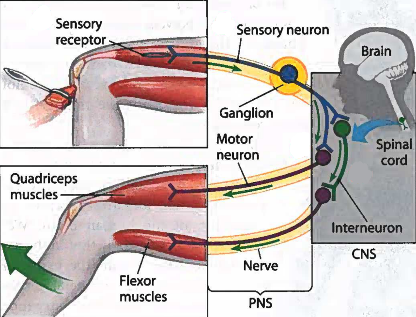

# Nervous System

## Structure of a Neuron

??? abstract "textbook representation of the structure of a neuron"
    

A neuron is a special type of cell, with a specific structure that enables it to transmit information in form of electrical impulses to other neurons:

- **cell body**: contains nucleus and other cell organelles
- **dendrites**: extensions made to **recieve** signals from other neurons; neuron usually has many dendrites
- **axon**: single, much longer extension made to **send** information to other cells[^1]; can be over a meter in length
- axon starts at the **axon hillock**, where the axon connects to the cell body
- the axon splits into multiple **axon terminals**[^2] at the end, transmitting information to the next dendrite via a **synapse**

Furthermore, there are **glial cells** that support the neurons in their functions, one of which is the **Schwann cell** *(see picture above)*:

- many Schwann cells together form the **myelin sheath**
- Schwann cells are thick, insulating cells that form a **bead-like structure** around the axon
- they aid in **accelerating the signal**[^3] by not letting it degrade as quickly, &rightarrow; voltage-gated channels along the axon can be **spaced out**
- voltage-gated channels are only found at the **Nodes of Ranvier**, which are the non-myelinated segments between Schwann cells
- Schwann cells facilitate the **saltatory conduction**[^4] of signals

## Resting Potential

- inside of a neuron is **negatively charged**
- **resting potential** inside the neuron is ca. $-70\ \text{mV}$ *(millivolt)*
- charge difference allows for flow of current when needed *(like a battery)*
- **outside** of the cell: lots of $\text{Na}^+$, very little $\text{K}^+$
- **inside** the cell: very little $\text{Na}^+$, lots of $\text{K}^+$
- $\text{K}^+$ ions can get out through some open $\text{K}^+$ channels
- $\text{Na}^+$ channels are closed, so most of it remains outside[^5]
- **sodium-potassium-pump** is responsible for getting *out* the $\text{Na}^+$ and getting $\text{K}^+$ back *into* the cell to **maintain the charge difference**

??? abstract "textbook representation of the resting potential at the cell membrane"
    

## Action Potential

- used to **transmit information** between neurons and other cells[^6]
- starts at the **axon hillock** of the neuron
- propagates along the axon until it reaches the axon terminal

The process of the action potential unfolds as following:

")

??? abstract "textbook representation of the action potential propagation"
    note that the hyperpolarisation phase is not labeled in the picture
    

## Stimulus-Response Scheme

Neurons can be classified into two categories:

- **central nervous system** (CNS): brain and spinal chord
- **peripheral nervous system** (PNS): all other neurons; **carry information to and from the CNS**

Each piece of information is processed according to this scheme:

1. **sensory input**: signal from sensory receptors *(e.g. eyes)* is sent to the CNS by **sensory neurons**
2. **integration**: interpretation of the signal and formulation of a response by **interneurons**
3. **motor output**: signal is transmitted to **effector cells** *(e.g. muscle cells or gland cells)* by **motor neurons**

??? abstract "textbook representation of the knee-jerk reflex"
    This reflex shows how the information is transmitted and processed. In this case, the chain is quite simple, but for more complex porcesses *(vision, auditory cues etc.)* the process involves many more neurons and also travels up the CNS into the brain to be processed.

    

## Multiple Sclerosis

- autoimmune disease[^7] where the **myelin sheath** around the axon is **damaged**
- signal **transmission is slowed down** and in severe cases disrupted
- can't be healed, but treatments for alleviating symptoms are available
- several symptoms are common:
    - difficulty walking
    - numbness
    - fatigue
    - balance problems
    - speaking difficulties
    - impaired vision
- first symptoms most commonly appear between the ages of 20 and 40 

[^1]: The other cell can be a neuron as well, but could also be e.g. a muscle cell
[^2]: Also called **synaptic terminals**
[^3]: A signal through a *non-myelinated* axon travels at around $5\ \text{m}/\text{s}$, whereas a *myelinated* axon allows for a much higher $150\ \text{m}/\text{s}$
[^4]: "saltatory": jumping from one Node of Ranvier to the next
[^5]: A little bit of $\text{Na}^+$ always diffuses into the cell, which is why it needs to be pumped back out
[^6]: The other cell can be a neuron as well, but could also be e.g. a muscle cell
[^7]: Type of disease where the body **attacks** its own **healthy cells**, mistaking them for something that needs to be destroyed
