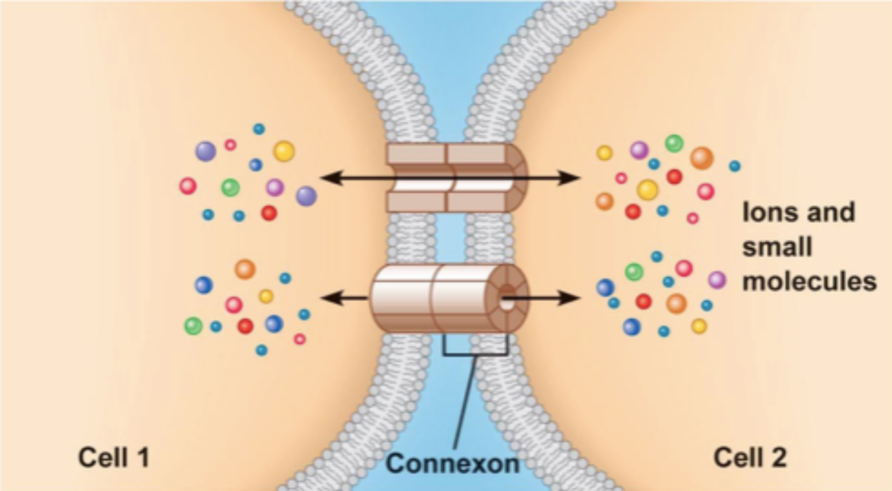

# Nervous System

## Structure of a Neuron

??? abstract "textbook representation of the structure of a neuron"
    

A neuron is a special type of cell, with a specific structure that enables it to transmit information in form of electrical impulses to other neurons:

- **cell body**: contains nucleus and other cell organelles
- **dendrites**: extensions made to **recieve** signals from other neurons; neuron usually has many dendrites
- **axon**: single, much longer extension made to **send** information to other cells[^1]; can be over a meter in length
- axon starts at the **axon hillock**, where the axon connects to the cell body
- the axon splits into multiple **axon terminals**[^2] at the end, transmitting information to the next dendrite via a **synapse**

Furthermore, there are **glial cells** that support the neurons in their functions, one of which is the **Schwann cell** *(see picture above)*:

- many Schwann cells together form the **myelin sheath**
- Schwann cells are thick, insulating cells that form a **bead-like structure** around the axon
- they aid in **accelerating the signal**[^3] by not letting it degrade as quickly, &rightarrow; voltage-gated channels along the axon can be **spaced out**
- voltage-gated channels are only found at the **Nodes of Ranvier**, which are the non-myelinated segments between Schwann cells
- Schwann cells facilitate the **saltatory conduction**[^4] of signals

## Resting Potential

- inside of a neuron is **negatively charged**
- **resting potential** inside the neuron is ca. $-70\ \text{mV}$ *(millivolt)*
- charge difference allows for flow of current when needed *(like a battery)*
- **outside** of the cell: lots of $\text{Na}^+$, very little $\text{K}^+$
- **inside** the cell: very little $\text{Na}^+$, lots of $\text{K}^+$
- $\text{K}^+$ ions can get out through some open $\text{K}^+$ channels
- $\text{Na}^+$ channels are closed, so most of it remains outside[^5]
- **sodium-potassium-pump** (aka $\text{Na}$-$\text{K}$ pump) is responsible for getting *out* the $\text{Na}^+$ and getting $\text{K}^+$ back *into* the cell to **maintain the charge difference**

??? abstract "textbook representation of the resting potential at the cell membrane"
    

## Action Potential

- used to **transmit information** between neurons and other cells[^6]
- starts at the **axon hillock** of the neuron
- propagates along the axon until it reaches the axon terminal

The process of the action potential unfolds as following:

")

??? abstract "textbook representation of the action potential propagation"
    note that the hyperpolarisation phase is not labeled in the picture
    

## Stimulus-Response Scheme

Neurons can be classified into two categories:

- **central nervous system** (CNS): brain and spinal chord
- **peripheral nervous system** (PNS): all other neurons; **carry information to and from the CNS**

Each piece of information is processed according to this scheme:

1. **sensory input**: signal from sensory receptors *(e.g. eyes)* is sent to the CNS by **sensory neurons**
2. **integration**: interpretation of the signal and formulation of a response by **interneurons**
3. **motor output**: signal is transmitted to **effector cells** *(e.g. muscle cells or gland cells)* by **motor neurons**

??? abstract "textbook representation of the knee-jerk reflex"
    This reflex shows how the information is transmitted and processed. In this case, the chain is quite simple, but for more complex porcesses *(vision, auditory cues etc.)* the process involves many more neurons and also travels up the CNS into the brain to be processed.

    

## Multiple Sclerosis

- autoimmune disease[^7] where the **myelin sheath** around the axon is **damaged**
- signal **transmission is slowed down** and in severe cases disrupted
- can't be healed, but treatments for alleviating symptoms are available
- several symptoms are common:
    - difficulty walking
    - numbness
    - fatigue
    - balance problems
    - speaking difficulties
    - impaired vision
- first symptoms most commonly appear between the ages of 20 and 40 

## Chemical Synapse

???+ note "Electrical Synapses" 
    While most neurons communicate through *chemical* synapses, repetitive and fast transfers are made possible through **electrical synapses** (aka *gap junctions*). Here, the neurons are physically connected to each other. Electrical synapses are used in situations like the communication between heart muscle cells.

    ??? abstract "textbook representation of electrical synapses"
        

- neurons don't physically touch each other
- signal needs to be transferred accross the **synaptic cleft** to pass to the next neuron
- signal passes from **pre**synaptic to **post**synaptic membrane
- signal is converted to **chemical form** to pass the cleft, then back to electrical signal

The process unfolds as following:

1. action potential arrives at the axon terminal *(presynaptic membrane)*
2. voltage-gated $\text{Ca}^{2+}$ channels open, letting $\text{Ca}^{2+}$ into the cell
3. **synaptic vesicles** merge with the presynaptic membrane
4. **neurotransmitters** *(in this case **acetylcholine**)* previously contained in synaptic vesicles are released **into the synaptic cleft**
5. acetylcholine **binds to $\text{Na}^+$ channels**, opening them
6. $\text{Na}^+$ flows into the cell, triggering an [action potential](#action-potential)
7. acetylcholine is **broken down by *acetylcholine esterase*** into acetyl and choline

    > If it wouldn't be broken down, the acetylcholine would just keep the $\text{Na}^+$ channels open

8. the acetyl and choline are transported back into the cell and repackaged into the synaptic vesicles
9. the synapse is ready for the next action potential

## EPSPs and IPSPs

> **E**xcitatory and **I**nhibitory **P**ost**S**ynaptic **P**otentials

**EPSP**:

- uses an **excitatory neurotransmitter** *(e.g. acetylcholine)*
- makes the inside of the postsynaptic cell **more positive** *(in the case of acetylcholine through influx of &nbsp;$\text{Na}^+$)*
- gets the cell closer to the $-55\ \text{mV}$ threshold required for an action potential
- causes **depolarization** of the cell *(makes it more positive)*

**IPSP**:

- uses an **inhibitory neurotransmitter** *(e.g. GABA)*
- makes the inside of the postsynaptic cell **more negative** *(in the case of GABA through influx of &nbsp;$\text{Cl}^-$)*
- gets the cell further from the $-55\ \text{mV}$ threshold required for an action potential
- causes **repolarization** of the cell *(makes it more negative)*

The process fo transmitting a PSP involves more than one synapse, with neurons having thousands of synapses that aid in the **summation of postsynaptic potentials**:

- one EPSP alone is usually **not enough** to generate an actoin potential in the postsynaptic neuron
- it usually takes **several EPSPs** (and **fewer IPSPs**) for an action potential to be generated at the **axon hillock**

??? abstract "Textbook representation of the summation of the EPSPs and IPSPs"
    

## Dopamine and Serotonin

- neurons learn by **strengthening desirable connections**

    > strengthening occurrs through **wider synapses**, **more channels** or **more neurotransmitters**, all to encrease the chance of an action potential when that pathway[^8] is used

- when something good is done, the brain releases **serotonin** to remember that the action is good
- serotonin is a type of neurotransmitter that makes you happy
- **hippocampus** stores the memories of what caused the secretion of serotonin in the past
- when another opportunity for serotonin arises, **dopamine** is produced to encourage us to act on our desire
- dopamine is a type of neurotransmitter that makes you *anticipate* hapiness

The body goes through multiple steps when employing the reward system:

1. The hippocampus recognizes an opportunity for an action that it remembers was good last time &rightarrow; **dopamine is released**
2. When engaging in the activity you felt the urge for *(because of the dopamine)*, you feel happy &rightarrow; **serotonin is released**
3. The brain remembers the activity that lead to hapiness so it can **release dopamine the next time** it encounters the opportunity

???+ warning "which neurotransmitter does what"
    It's not the *dopamine* that makes you happy, but the **serotonin**. Dopamine makes you *want* to do something.

    ---
    ##### Example: Eating chocolate

    1. You see the chocolate and remember that you felt happy the last time you ate chocolate &rightarrow; **dopamine** is released
    2. You eat the chocolate &rightarrow; **serotonin** is released &rightarrow; you feel happy
    3. The hippocampus **remembers** that eating chocolate is something that indeed makes you happy, so it will release dopamine again the **next time** you see chocolate
    
## Brain Anatomy
### High-Level Secions

!!! note
    We watched a video on the topic, which you can find [here](https://www.nanoo.tv/link/v/FCmYgGmP).

The brain consists of multiple parts:

> The closer you get to the spinal cord, the more basic the functions of that region become

### Lower-Level Sections

- **brainstem**:
    - breathing, circulation, digestion
    - routing & filtering sensory information & motor output
- **cerebellum**:
    - motor control
    - motion / muscle memory
- **thalamus**: data sorting
- **hypothalamus**: homeostasis[^9]
- **posterior pituitary gland**: sends out hormones
- **cerebrum**: integration *(processing incoming data)*
- **corpus collosum**: connection between two brain hemispheres that also allows them to communicate

> Brain consists of **two hemispheres**, between which specific tasks are divided. While the **right** half of the brain is oriented more towards things like **facial recognition**, the **left** side of the brain is responsible for **logical reasoning**, math or speech

??? abstract "Position of the sections in the brain"
    

### Lobes of the Cerebral Cortex

The cerebral cortex comprises about 80% of the entire brain and is divided into four lobes, each with different functions.

- **frontal lobe**: executive functions and emotional control *(impulses, planning, regulating attention)*
- **parietal lobe**: processing sensory input
- **occipital lobe**: vision
- **temporal lobe**: language, hearing, memories

??? abstract "Names of the lobes in the brain"
    

There are two more notable regions in the brain that are very important for movement and sensory processing:

- **sensory cortex** *(aka somatosensory cortex)*: take in and process sensory signals
- **motor cortex**: send out signals to muscles based on the processing done in the sensory cortex

[^1]: The other cell can be a neuron as well, but could also be e.g. a muscle cell
[^2]: Also called **synaptic terminals**
[^3]: A signal through a *non-myelinated* axon travels at around $5\ \text{m}/\text{s}$, whereas a *myelinated* axon allows for a much higher $150\ \text{m}/\text{s}$
[^4]: "saltatory": jumping from one Node of Ranvier to the next
[^5]: A little bit of $\text{Na}^+$ always diffuses into the cell, which is why it needs to be pumped back out
[^6]: The other cell can be a neuron as well, but could also be e.g. a muscle cell
[^7]: Type of disease where the body **attacks** its own **healthy cells**, mistaking them for something that needs to be destroyed
[^8]: The connections between neurons are also called **pathways**
[^9]: Maintaining a constant body temperature, water level etc.
