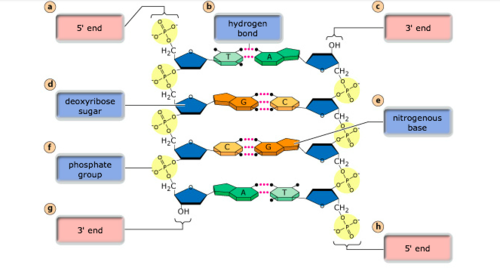

# Endocrine System & Molecular Biology 
## Endocrine System
- **hormones** &rightarrow; produced in glands or specialized cells
- transmission of information to control **metabolism & organs**
- transmitted through **bloodstream** &rightarrow; reaches entire body[^1]
- **lock-and-key** mechanism allows target cells to receive the correct hormones
- hormone receptors can be *on* or *inside* the cell
- same hormone can have **different effects** on different cells

[^1]: As opposed to electrical signals through neurons, which can only reach other neurons. Hormones also allow for finer dosage of stimuli.

**exocrine** glands: secrete substances **on surfaces** outside or inside the body *(e.g. sweat glands on skin)*
  
**endocrine** glands: secrete substances **into bloodstream** *(e.g. thyroid glands)*

## Hormones and their jobs

### Homeostasis
- process to keep body temperature stable (around ca. 37°C)
- **negative** feedback loop: if body temp falls &rightarrow; bring it back up
- body is heated by **burning ATP** *(adenosine triphosphate)*

how it works:

1. **hypothalamus**: feels temperature decrease &rightarrow; releases **TRH** 
2. **pituitary**: gets activated by TRH &rightarrow; releases **TSH** 
3. **thyroid**: gets activated by TSH &rightarrow; releases **thyroxine** to the target cells
4. thyroxine **accelerates** the metabolic rate in target cells &rightarrow; heat is released

### Growth
- **pituitary** releases **somatotropin** *(= Growth Hormone, GH)*
- somatotropin accelerates **cell division**

### Sex Hormones
- sex organs are formed at the transition from embryo &rightarrow; fetus
- **testosterone** develops male sex organs
- if testosterone is missing &rightarrow; **female** sex organs
- testosterone also controls **anabolism** *(muscle growth)*
- if enough testosterone is supplied externally (e.g. doping) &rightarrow; testicles shrink &rightarrow; potential sterility

> doping with testosterone leads to *masculinising* effect &rightarrow; women will look more like men; can be avoided by using **anabolic steroids** like *nandrolone*

### Sleep
- **melatonin** is responsible for making us tired
- melatonin is produced in the **pineal gland**, but only when it's not light
- melatonin production **decreases** with age &rightarrow; old people sleep less

### Oxytocin
- before birth &rightarrow; oxytocin triggers **contractions** &rightarrow; contractions trigger more oxytocin *(positive feedback loop)*
- crying babies release oxytocin in mothers &rightarrow; breast milk is released

### Beer Breasts
- beer contains substances similar to **estrogen**
- in belly fat *(caused by drinking beer)* &rightarrow; conversion from **testosterone to estrogen**
- development of chest similar to that of women in puberty

### Doping in Cycling
- **erythropoietin** (EPO) causes production of more erythrocytes *(red blood cells)*
- more red blood cells &rightarrow; more **endurance**
- dangerous due to increased blood viscosity &rightarrow; potential **blood clotting**
- popular in cyclists because of effect on endurance

!!! info "Hormones from other animals"
    Many hormones function across species. If you take the melanotropin from another animal and inject it into some frogs, they will turn darker. Furthermore, you can use the thyroxine from any animal to cause amphibians to grow up (metamorphose) faster than they should.

## Blood Sugar Regulation
If the food is rich in carbohydrates:

1. glucose content in blood **rises**
2. **insulin** is released from the *pancreas* and binds to target cells *(e.g. muscle, liver or fat cells)*
3. glucose molecules are chained together to form **glycogen** *(storage form of glucose)*
4. glycogen is stored inside the cell

> In **fat cells**, a complex process is used to transform the glucose into fat instead of glycogen

If you exercise, fast or otherwise lower your blood sugar level:

1. glucose in blood **drops**
2. **glucagon** is released from the *pancreas* and binds to target cells *(e.g. muscle or liver cells)*
3. glycogen is **torn apart** into glucose molecules again
4. glucose is fed into the blood stream

There are also other hormones that can *release* glucose into the blood:

- **adrenaline**: used in fight-or-flight response; short-term stress
- **cortisol**: when you're stressed for longer periods of time

> Being stressed for long periods of time causes the pituitary to release ACTH, which causes the adrenal gland to release cortisol. When this is the case, fats and proteins are broken down, but your immune system is weakened.

## Female Menstrual Cycle

- **egg cells** mature in the **ovaries** inside *follicles* *(days 1-14)* - caused by **FSH**

> The follicles are made up of an egg cell and the **follicular epithelium** that surrounds it. The latter grows during the follicular phase *(days 1-14)*, so that it forms a fluid-filled cavity inside.

-  increased blood supply & thickening of **endometrium** *(uterine mucosa)* *(days 5-14)*
- mature follicle (now called *Graafian follicle*) releases the egg cell into the *fallopian tube* &rightarrow; **ovulation** *(day 14)* - caused by **LH**

> The pressure inside the fluid cavity of the Graafian follicle has become so big that the follicle bursts, letting the egg cell into the fallopian tube.

> The release of both FSH and LH from the pituitary gland is controlled by **FSH/LH-RH**, which is produced in the hypothalamus.

 - Graafian follicle travels through the fallopian tube to the **uterus** (womb) *(days 14-17)*
 - mucus in the **cervix** is now easily permeable by sperm *(days 14-28)*
 - Graafian follicle develops into **corpus luteum** &rightarrow; produces **progesterone** *(days 14-22)*

> progesterone makes the mucus plug in the cervix firm again &rightarrow; **protected** from infections. It also **prevents a new follicle** from forming.

 - endometrium produces **mucous substance** for embryo environment *(days 14-28)*
 - *Only if the egg cell is fertilized*: embryo digs into the endometrium for optimal growth conditions &rightarrow; **implantation** *(days 17-21)*
 - corpus luteum **degenerates** *(day 22-28)*
 - *Only if the egg cell is not fertilized*: endometrium is **shed** *(days 28-4)*

### Phase Naming
- days 28-4: **menstrual** phase *(shedding the endometrium)*
- days 1-14: **follicular** phase *(follicle develops in ovary)*
- days 5-14: **proliferation** phase *(endometrium thickens + increased blood flow)*
- days 14-28: **secretion** phase *(endometrium secretes mucous substance)*

### Hormone Regulation
- hypothalamus produces **FSH/LH-RH** &rightarrow; release of **FSH** & **LH** in the pituitary
    - FSH causes **follicle maturation**
    - LH causes the follicular epithelium to become the **corpus luteum** on day 14

> The follicular epithelium produces **estrogen**, which works in a **positive feedback loop** to make *even more* FSH/LH-RH in the hypothalamus. This goes on until day 14 (ovulation)

- newly formed corpus luteum produces **estrogen** and **progesterone**
    - progesterone causes **secretion phase** in endometrium
    - both progesterone & estrogen have **inhibitory** effect on hypothalamus &rightarrow; less FSH & LH *(negative feedback loop)*
- corpus luteum degenerates &rightarrow; **no more** progesterone & estrogen to **stop** hypothalamus from producing FSH/LH-RH &rightarrow; production **picks up** again
- cycle starts again

### Pregnancy
- fertilized egg cell burrows into the endometrium *(implantation)*
- **placenta** is formed &rightarrow; produces **hCG**
- hCG has effects similar to LH &rightarrow; **prevents** corpus luteum degeneration
- corpus luteum continues to inhibit the production of FSH/LH-RH &rightarrow; **no new follicle** is formed
- **pregnancy tests** look for hCG to see if a placenta has been formed *(which indicates a fertilized egg cell)*

### Birth Control
- contraceptive pills use **progesterone** to harden the mucus of the cervix &rightarrow; harder for egg cells to enter
- progesterone also **inhibits** the production of FSH & LH in the hypothalamus

## DNA structure
- full name: _**D**eoxyribo**N**ucleic **A**cid_
- **phosphate & sugar**: build the outer helical structure that the bases attach to
- **bases**: _**A**denine_ (A), _**G**uanine_ (G), _**C**ytosine_ (C) & _**T**hymine_ (T)
- bases have fixed combination: **A** &hArr; **T** and **C** &hArr; **G**

??? note "Textbook representation of a DNA fragment"
    - The DNA molecules chain together by linking the **3' location** to the **5' location**, while the bases *(A, T, C or G)* are attached to the **deoxyribose**.
    
    
      

    - The two **strands** of a DNA molecule are **antiparallel** &rightarrow; 3' end on one strand corresponds to 5' end on the other strand
    
    

## DNA duplication
You can find a video that explains it well [here](https://www.youtube.com/watch?v=9kp9wiYMQUU).

1. **helicase** breaks hydrogen bonds between bases &rightarrow; DNA is split into 2 strands
2. **primase** installs an *RNA primer*[^2] to create an entry point for the new DNA
3. **DNA polymerase** attaches actual DNA to the RNA primer in the direction of **5' &rightarrow; 3'**, not the other way around
4. **leading strand** replicates *along* with the direction of the helicase
5. **lagging strand** replicates *away from* the direction of the helicase &rightarrow; new primer is required after every **Okazaki fragment**[^3]
6. DNA polymerase goes through again to turn all **RNA primers** into **DNA**
7. **ligase** connects DNA fragments together again

!!! note Process Properties
    The duplication of DNA molecules is called a **semi-conservative** process. This means that the DNA is made up of 50% of the **old** DNA *(template DNA strand)*, and 50% **newly generated** DNA *(complementary DNA strand)*

## Chromosome structure
DNA is packaged into chromosomes when cells are duplicated. This process unfolds as following:

1. DNA is wound 2x around *histones* &rightarrow; **histone protein complex**
2. histones are compressed further into **chromatin**
3. a chromosome forms, made up of two **chromatids** connected at the **centromere**

## Protein structure
- made up of **amino acids**
- sequence of amino acids determines **function** of the protein

### Examples of Proteins
- **myosin**: motor protein, contains **thousands** of amino acids
- **keratin**: structure protein *(e.g. in hair)*, contains **hundreds** of amino acids
- **amylase**: enzyme *(in saliva & intestine)*, contains **~1'000** amino acids
- **insulin**: hormone, contains **51** amino acids

## Griffith and Avery's Experiments
Griffith (1928):

- demonstrated that genetic information is **not** transmitted by proteins, but by DNA.
- used a bacterium with a **virulent** (S) and a **non-virulent** (R) strain
- living R strain could inherit virulent property from **dead** S strain &rightarrow; R strain turned into S strain
- conclusion: transmission of genetic information is done through a **transferable** substance

Avery (1944):

- extracted only DNA from dead S strain & mixed it with living R strain &rightarrow; virulent property was **successfully** transferred
- process did not work with proteins
- conclusion: transmission of genetic information is done by **DNA** &rightarrow; called *transformation*

[^2]: usually ca. 5-10 nucleotides long

[^3]: Ca. 100-200 nucleotides long
