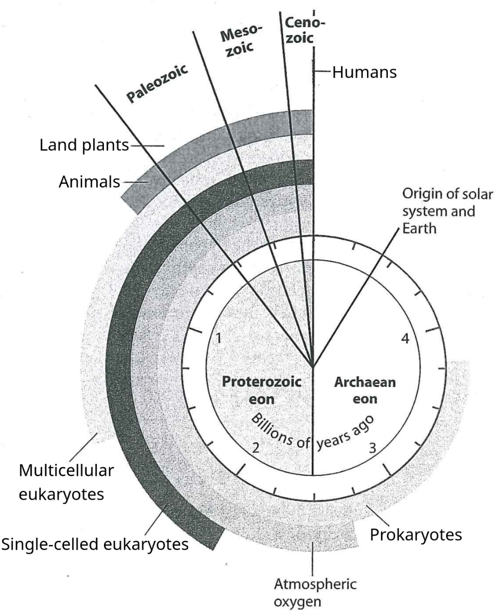
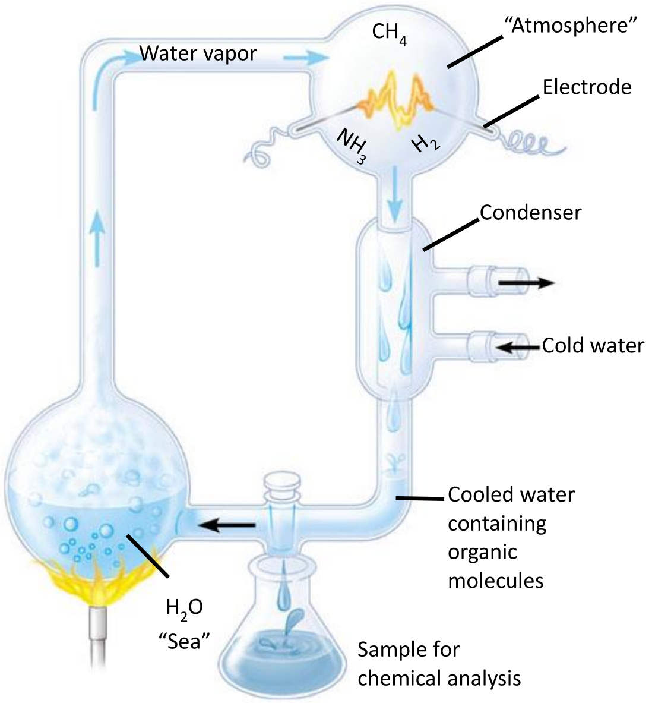
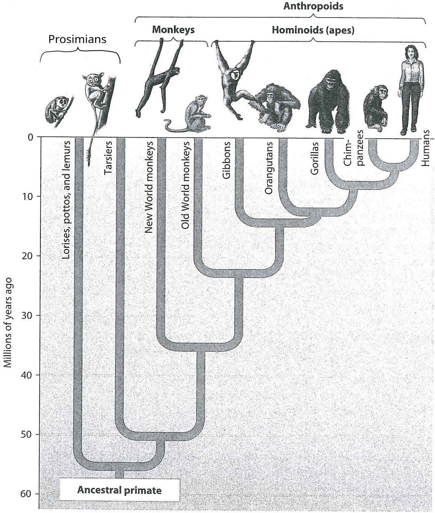
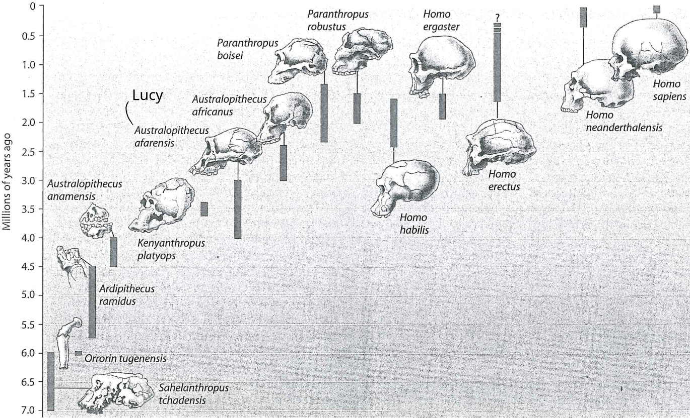
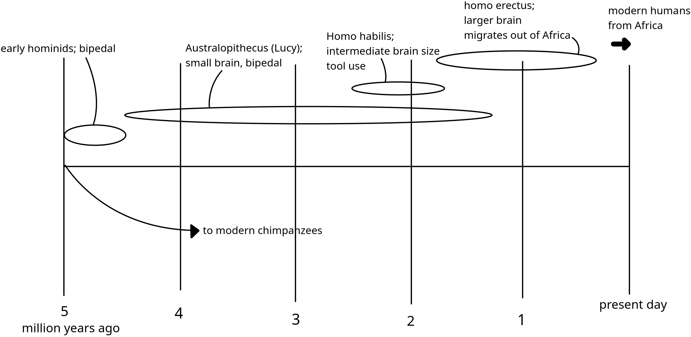

# Evolution

## Scientific Method

- **discovery science**:
    - exploring scientific questions and seeing what pops up
    - conclusions through **inductive reasoning** &rarr; from specific observations to general rules
- **hypothesis-based science**:
    - proposing and testing of a concrete hypothesis
    - conclusions through **deductive reasoning** &rarr; from general observations to specific rules

???+ tip "Example: inductive vs. deductive reasoning"
    - **Inductive**: _"All 500 organisms we have examined are made of cells"_ &rarr; _"All organisms are made of cells"_
    - **Deductive**: _"All organisms are made of cells and humans are organisms"_ &rarr; _"Humans are made of cells"_

- - -
## Theory of Evolution

The first theory proposed by **Charles Darwin** in 1859 in his book _On the Origin of Species by Means of Natural Selection_ described evolution in two important parts:

**descent with modification**:

- animals descend from a common ancester
- diversification of genes alters species over time

**natural selection**:

- _individual variation_: traits that are passed on to offspring vary between individuals
- _overproduction and competition_: population produces more offspring than the environment can sustain &rarr; competition
- **unequal reproductive success**: individuals best suited to the environment will generate better-suited offspring

> The product of natural selection is **evolutionary adaptation**, in which populations accumulate favourable traits over time.

### Evidence for Evolution

- **fossils**: analysis of fossilised organisms and comparison to today's species
- **biogeography**: animals diversified in geographical isolation &rarr; comparison to [continental drift](../../gg/5/summary.md#plattentektonik)
- **comparative anatomy**: similarity in characteristics _(e.g. bone structure)_ stems from common ancestor &rarr; **homologous structures**[^1]
- **vestigial organs**: leftover organs that have now become useless and start to vanish over time
- **comparative embryology**: comparison of early development accross species
- **molecular biology**: similar amino acid sequences in proteins hint at close ancestral relationship

observable features of natural selection:

- "editing process" &rarr; changes occur over time and not every change is beneficial
- favours characteristics that fit the **current** place, time and local environment
- quick change in environment &rarr; quick evolutionary response
- doesn't create traits on-demand &rarr; selection of best-working traits in the current environment

[^1]: Features that often have different functions but are structurally similar due to common ancestry

- - -
## Genetics

Some useful vocabulary:

- **genome**: all the genes in an organism
- **gene pool**: all the genes in a population
- **microevolution**: changes in gene pool
- **macroevolution**: causes the origin of a new species
- **morph**: discrete phenotypic characteristic that differs between individuals of a species
- **polymorphic species**: a species with 2 or more morphs in significant numbers
- **cline**: gradual change in a trait accross a geographic continuum[^2]

[^2]: Example: Birds tend to get larger towards the north and smaller towards the equator

### Genetic Drift

- random changes in allele frequency within a population
- largest effect in small populations
- loss of genetic variation &rarr; _fixation_ (freq. = 100%) or _loss_ (freq. = 0%)

Situations that decrease population size and thus promote genetic drift:

- **bottleneck effect**:
    - event that drastically reductes population size
    - e.g. natural disasters, diseases
    - gene pool becomes unrepresentative of original population
- **founder effect**:
    - part of an existing population becomes separated from the rest
    - e.g. continental drift
    - new population develops from limited gene pool

> Loss of genetic variation can present challenges for populations, e.g. when facing a new disease: Since everybody has very similar genes, **no individual is immune and could pass on the gene**. Therefore, the population risks dying out.

### Gene Flow

- individuals from one population mates with an individual from another population
- reduces differences between populations
- introduces new genes into the gene pool of a population

### Variation

- **mutation** is the ultimate source of genetic variation
- mutation rates in plants and animals are low[^3] &rarr; rely primarily on sexual recombination
- **sexual recombination** includes crossing over, independent assortment and random fertilisation
- bacteria and viruses have high mutation rates and short generation spans &rarr; high genetic variation

[^3]: about 1 in 100'000 genes per generation is mutated

### Evolutionary Fitness

- **fitness**: contribution an individual makes to the gene pool of the next generation
- fittest individuals produce the **most viable, fertile offspring**
- sterile individuals &rarr; zero fitness _(even if the genes would be desirable)_

- - -
## Modes of Natural Selection

Starting from a normal distribution of phenotypes, natural selection can reshape a population in three ways:

**stabilising selection**:

- favours **intermediate** / average phenotypes; eliminates extremes
- reduces phenotypic variation
- most common in **stable environments**
- example: human birth weight (3–4 kg is optimal)

**directional selection**:

- shifts the population toward **one extreme**
- common during **environmental change** or migration to new habitats
- example: insects developing insecticide resistance

**disruptive selection**:

- favours **both extremes** over intermediate phenotypes; splits into distinct morphs
- can lead to **balanced polymorphism**
- occurs when the environment favors individuals at both ends of a range
- example: bird beak sizes in the Galápagos Islands

> Birds with small beaks eat soft seeds, birds with large beaks eat hard seeds, while birds with medium beaks struggle with both

## Sexual Dimorphism

- noticeable differences in appearance between males and females _(beyond reproductive organs; e.g. size, antlers or plumage)_
- caused by intra- and intersexual selection

### Intrasexual Selection
- competition **within the same sex** for mating access (usually males)
- often involves ritualized combat or display
- winner gains access to a harem of females

### Intersexual Selection
- one sex (usually females) **chooses** mates based on appearance or behaviour
- males with the most elaborate traits _(e.g. peacock tail)_ are preferred &rarr; sign of health / good genes
- each female choice perpetuates the alleles behind that male's traits
- seemingly detrimental traits _(e.g. colourful plumage that attracts predators)_ persist if they increase reproductive success

- - -
## Imperfect Organisms

Natural selection can't make perfect organisms:

- **historical constraints**: evolution modifies existing structures _(e.g. bird wings evolved from reptilian leg bones)_
- **adaptations are compromises**: organisms must do many things at once; traits optimized for one function may hinder another (e.g. a blue-footed booby's webbed feet)
- **influence of randomness**: genetic drift and random events _(e.g. storms dispersing insects)_ can fix non-optimal alleles in small populations
- **selection edits existing variation**: new alleles don't form on demand &rarr; selection can only choose from what's available

- - -
## Species

> Animals are of the same species if they can interbreed to produce **viable, fertile offspring**, which can in turn also produce offspring.[^4]

- **speciation**: changes in a gene pool so that the population forms a new species
- **allopatric** speciation: speciation caused by geographic isolation
- speciation has only occured if **reproductive barriers** have been established

[^4]: e.g. Mules (male donkey + female horse) are infertile and thus don't belong to either species.

### Reproductive Barriers

**prezygotic** barriers: (prevent mating or fertilisation)

- **temporal** isolation: mating occurs at different seasons / times of day
- **habitat** isolation: populations don't meet due to having different habitats
- **behavioural** isolation: no sexual attraction between species
- **mechanical** isolation: structural differences in genitalia prevent transfer of gametes
- **gametic** isolation: gametes die before uniting or fail to unite

**postzygotic** barriers: (prevent the development of fertile adults)

- hybrid **invariability**: hybrids fail to develop or reach sexual maturity
- hybrid **sterility**: hybrids fail to produce functional gametes
- hybrid **breakdown**: offspring of hybrids are weak or infertile

- - -
## Adaptive Radiation

- evolution of new species from common ancestor
- usually occurs in new environments or after extinctions
- species undergo multiple processes of allopatric speciation
- strong correlation between new traits and environmental conditions

- - -
## Evolutionary Trends

- species that generate the **most offspring** determine direction of major evolutionary trends
- evolutionary trends may cease or even reverse if the environment changes
- evolution rewards organisms that survive the longest to generate the most offspring

- - -
## Origin of life

- Earth formed ca. 4.6 billion years ago
- first atmosphere mostly $H_2$, $CO_2$, $N_2$, $H_2S$, $H_2O$, $CH_4$, $NH_3$

??? abstract "Textbook representation of the development of the Earth"
    **Order:**

    1. Prokaryotes
    2. Atmospheric oxygen
    3. single-celled eukaryotes
    4. Multicellular eukaryotes
    5. Animals
    6. Land plants
    7. Humans

    

- small organic molecules likely preceded the first form of life
- formation of polymers from organic monomers as second stage in origin of life
- replication mechanism of polymers leads to primitive form of **heredity**

### Miller's Experiment

- Miller wanted to simulate conditions on early Earth
- large numbers of amino acids formed from gases &rarr; explanation for **origin of life**
- proved that **organic matter** can arise from **inorganic** matter in young-earth conditions

??? abstract "Schematic drawing of Stanley Miller's experiment"
    

- - -
## Primate Diversity

- **apes** &rarr; no tail
- **monkeys** &rarr; tail; forelimbs are same length as hind limbs
- **Anthropoids** include **hominoids** and **monkeys**
- **Hominoids** include **gibbonds, orangutans, gorillas, chimpanzees** and **humans**

**old world monkeys**:

- evolved in Africa and Asia
- no prehensile tail
- nostrils open downward
- e.g. macaque, mandrill, baboon, rhesus monkey

**new world monkeys**:

- evolved in Americas
- **prehensile** tail &rarr; designed to grab e.g. tree limbs
- nostrils far apart and open to the side
- e.g. tamarin, capuchin monkey, spider monkey, marmosets

??? abstract "Diagram showing the development of primates"
    

??? abstract "Diagram of evolution of hominid species"
    
    

- - -
## Humans

### Skin Colour

- hominoids were walking long distanges &rarr; kept cooler without hair
- skin was now directly exposed to sunlight
- dark skin protects better against UV light
- UV also enables synthesis of vitamin D
- northern latitudes &rarr; less UV light &rarr; less pigmentation to still receive vit. D

### Language

- many animals use sounds to convey basic information _(e.g. danger, food sources, mating behaviour)_
- humans seem to be the only ones to actually talk about complex topics
- _FOXP2_ gene is widespread in many animals (not only hominids)
- humans have a slightly altered _FOXP2_ gene
- emergence of human form of _FOXP2_ matches emergence of _Homo Sapiens_
- responsible for development of brain areas linked to speech
- birds use _FOXP2_ gene for song learning &rarr; transmitting information

### Culture

- parents in _Homo Sapiens_ raised their children for a longer amount of time
- extended opportunity to convey information to offspring
- **culture** is formed &rarr; transmitting accumulated knowledge, customs, beliefs etc.

**scavenging and gathering**:

- humans relied mostly on scavenging / stealing fresh kills from **other predators**
- gathering of **wild fruits, seeds** and **roots**
- tools later became sophisticated enough that hunting became efficient
- semipermanent residences near hunting grounds were established 

**agriculture**:

- agriculture developed strongly in [fertile crescent](https://en.wikipedia.org/wiki/Fertile_Crescent)
- ca. 5000 years ago &rarr; plows & other tools became used
- populations increased with agriculture
- people could diversify their activities as not everyone needed to gather food

**complex tools**:

- industrial revolution in 18th century
- small-scale hand production &rarr; large-scale machine production
- demand for energy sources rises
- availability of food & reduction of disease &rarr; large drivers of advancements

