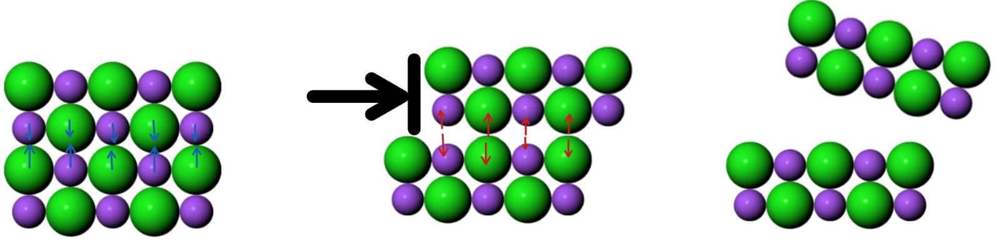
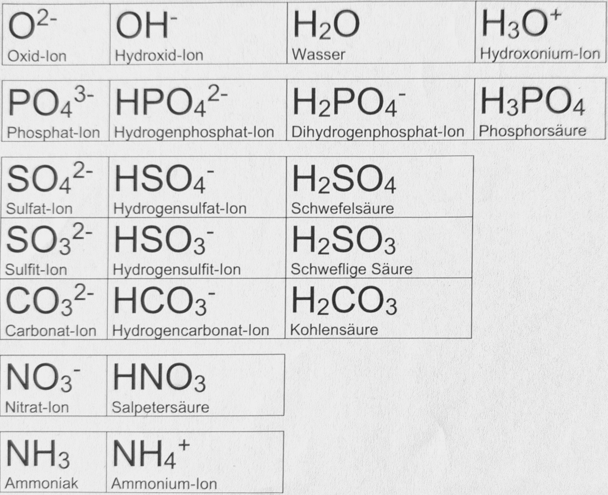
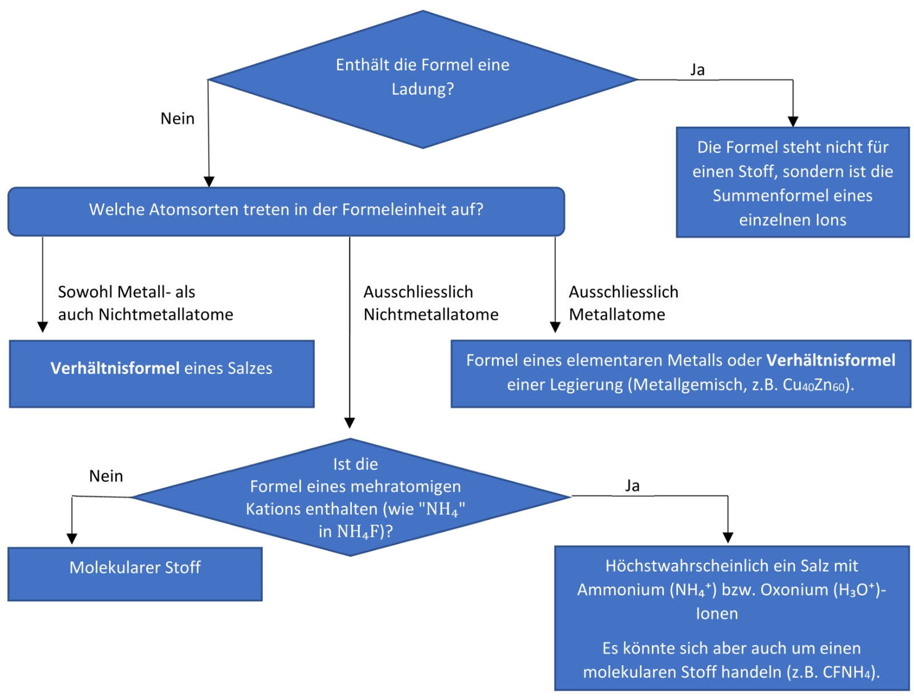

## Löslichkeit von Stoffen

> Die zwischenmolekularen Wechselwirkungen (ZMW) sind Repetition, die ausführlichen Erklärungen sind im [letzten Thema](../2/summary.md) zu finden.

- Wasser macht **Wasserstoffbrücken** (WBR), die stark zusammenhalten
- geht ein Stoff **WBR** ein, wird es ins "Gitter" der $H_2O$-WBR integriert &rightarrow; Es löst sich im Wasser
- geht ein Stoff **keine** WBR ein, mischt er sich nicht mit Wasser *(Er wird "rausgedrückt")*
- löst sich ein Stoff **nicht** in Wasser, löst er sich höchstwahrscheinlich in **Fett**

!!! note "Namensgebung für Löslichkeit"
    - Fettlösliche Stoffe sind **lipophil** und meistens **hydrophob**
    - Wasserlösliche Stoffe sind **hydrophil** und meistens **lipophob**
    - Stoffe, die sich in beiden lösen, heissen **amphiphil** *(z.B. Aceton)*

## Oberflächenspannung

- Moleküle an der Oberfläche eines Stoffes können nach oben **keine WBR** eingehen
- mit steigender Oberfläche nimmt **Gesamtanzahl** WBR ab
- Zerreissen von WBR **braucht Energie** &rightarrow; energetisch ungünstig
- Oberflächenspannung als Resultat des **Energieminimums**

## Superhydrophobe Oberflächen

Beispielsweise die Lotusblüte wird nie schmutzig, auch wenn sie mit schmutzigem Wasser bespritzt wird. Das liegt daran, dass das Wasser einfach an der Blüte abperlt.

- auch bei Wasser auf hydrophoben Stoffen gibt es immer noch **Adhäsionskräfte**[^1]
- Blüte hat hydrophobe *und* **raue** Oberfläche
- raue Oberfläche &rightarrow; weniger Adhäsionskräfte
- Wasser kann **nicht** in den Stoff **eindringen**, um sich zu lösen &rightarrow; perlt einfach ab

[^1]: Kräfte zwischen Wasser und Oberfläche, die das Wasser ein wenig auf der Oberfläche haften lassen.

## Bindungsentalphie

- Bindungsentalphie $\Delta H_B$ für eine Bindung $X - Y$ wird als $\Delta H_{X - Y}$ notiert
- **homolytische** Bindungsspaltung: bEP[^2] wird wieder auf Bindungspartner aufgeteilt ($X-Y \rightarrow X\cdot + \cdot Y$)
- **heterolytische** Bindungsspaltung: bEP bleibt am elektronegativeren Atom kleben ($X - Y \rightarrow X|^- + Y^+$)
- beim **Eingehen** einer Bindung wird Energie **freigesetzt**
- beim **Spalten** einer Bindung wird Energie **verbraucht**
- Energiebetrag aus **1 mol** Bindungen &rightarrow; **Bindungsentalphie**
- **Doppel- und Dreifachbindungen** haben grössere Bindungsentalphie
- **stärker polare** Bindungen haben grössere Bindungsentalphie
- **kürzere** Bindungen haben grössere Bindungsentalphie

!!! note "Reaktionen mit Polaren Bindungen"
    Apolare und schwach polare Bindungen werden **einfach gespalten**. Wenn in einer Reaktion also schwach polare gespalten und stark polare Bindungen aufgebaut werden, verläuft die Reaktion meist **exotherm**.

[^2]: bindendes Elektronenpaar

## Reaktionsentalphie

- Reaktionsentalphie $\Delta H_R$

Vorgang einer chemischen Reaktion:

1. Bindungen zerreissen &rightarrow; Energie **verbraucht**
2. Reaktion befindet sich im **Übergangszustand** *(höchster Punkt im Energiediagramm)*
3. entstandene Atome / Ionen kombinieren sich wieder zu stärker polaren Bindungen &rightarrow; Energie **wird frei**

??? example "Berechnung der Reaktionsentalphie"
    Formel für die Reaktionsentalphie:

    $$\Delta H_R = \Sigma \ \Delta H_B \ \text{(Produkte)} - \Sigma \ \Delta H_B \ \text{(Edukte)}$$

    Dabei ist folgendes Wichtig:

    - $\Delta H_R < 0$ &rightarrow; **exotherme** Reaktion
    - $\Delta H_R > 0$ &rightarrow; **endotherme** Reaktion
    - Term $\Sigma \ \Delta H_B \ \text{(Produkte)}$ ist **negativ** *(Bindungen werden erstellt)*
    - Term $\Sigma \ \Delta H_B \ \text{(Edukte)}$ ist **positiv** *(Bindungen werden gespalten)*
    - Falls die gleiche Art Bindung **mehrmals** gespalten / geknüpft wird, wird auch **mehrmals** die Bindungsentalphie verbraucht / freigesetzt
    - falls Reaktanden nicht im gleichen **Aggregatszustand** sind &rightarrow; Schmelz- / Verdampfungsentalphien mit einbeziehen

## Reaktionstypen

## Exotherme Reaktionen

- Energie wird **freigesetzt**[^3] &rightarrow; $\Delta H_R < 0$
- Wärme entsteht
- Teil der freigesetzten Energie geht zurück in die Fütterung der Reaktion
- Reaktion muss nur gestartet werden und läuft dann von selbst ab

[^3]: Energie wird frei und verlässt das System &rightarrow; Energie im System **sinkt**

### Endotherme Reaktion

- Energie wird **verbraucht**[^4] &rightarrow; $\Delta H_R > 0$
- System kühlt ab
- wird die Energiequelle abgestellt &rightarrow; **Reaktion hört auf**

[^4]: Energie wird gebraucht, um Bindungen zu spalten &rightarrow; Energie im System **steigt**

## Metalle

- hohe elektronische & thermische Leitfähigkeit
- metallischer Glanz
- zugfest trotz Verformbarkeit
- Korrosion sehr unterschiedlich
- Variation in Härte / Zähigkeit

### Aufbau

- **kleine Rumpfladung** &rightarrow; schwache Anziehung von Valenzelektronen
- tiefe **Ionisierungsenergien**[^5] und **Elektronegativitäten**
- Metallatome ziehen sich gegenseitig an &rightarrow; Entstehung von einem **Valenzelektronengas**[^6]
- Atome im Metall tauschen ständig Elektronen aus &rightarrow; **Ladung** erscheint **konstant**
- Bindungstyp in Metallen heisst **Metallbindung**
- Elektronen sind **delokalisiert** *(kein fester Ort)*

[^5]: Nötige Energie, um einem Atom ein Elektron wegzunehmen
[^6]: Natürlich kein richtiges Gas
### Stromfluss in Metallen

- Strom = **Fluss geladener Teilchen** *(Ionen, Elektronen)*
- in Metallen &rightarrow; Elektronen finden neue Plätze im Valenzelektronengas
- Elektronen stossen immer wieder auf **Atomrümpfe** und werden abgebremst &rightarrow; **Widerstand**
- je unregelmässiger das Atomgitter, desto grösser der Widerstand
- höhere Temperaturen bewirken **Schwingung** der Atome &rightarrow; höherer Widerstand

### Wärmeleitfähigkeit

- Elektron nimmt bei Zusammenstoss mit warmem Rumpf viel **Bewegungsenergie** auf
- Elektron transportiert die Bewegungsenergie weiter, bis zum nächsten Zusammenstoss mit einem kälteren Rumpf &rightarrow; gibt Energie wieder ab

### Duktilität und Störstellen

- **Duktilität** = Verformbarkeit eines Materials
- bei Verformung &rightarrow; Rumpfschichten bewegen sich **an einander vorbei**
- Elektronen finden auch nach dem Verbiegen sehr leicht einen Platz
- **Störstellen** = Orte, wo Rümpfe nicht mehr im perfekten Gittermuster angeordnet sind
- Rümpfe können nicht gut an Störstellen vorbeigeschoben werden &rightarrow; Metall wird **härter** & **spröder**
- Störstellen entstehen durch wiederholtes Verbiegen, Schmieden, Erhitzen & schnell Abkühlen usw.

???+ tip "Schmieden"
    Beim Schmieden ist das Ziel, das Metall hart zu machen, indem man Störstellen einführt. Dabei geht man wie folgt vor:

    1. Metall heiss machen &rightarrow; Rümpfe lassen sich besser verschieben
    2. durch schlagen Störstellen einfügen
    3. durch Abschrecken *(z.B in Wasser)* Störstellen festigen
    4. Metall heiss machen &rightarrow; Störstellen heilen wieder teilweise
    5. durch Schlagen noch mehr Störstellen einfügen
    6. wieder abschrecken
    7. und so weiter

### Legierungen

- Verbindungen **unterschiedlicher** Metallatome
- Rümpfe unterschiedlicher Grössen gleiten nicht so gut übereinander &rightarrow; **härter** als elementare Metalle
- Störstellen werden beim Verbiegen schneller gebildet &rightarrow; **spröde**
- Elektronen haben unregelmässigere Wege &rightarrow; **kleinere Leitfähigkeit**
- Rümpfe sind weniger gleichmässig angeordnet
- weniger Energie erforderlich, die Rümpfe von einander zu trennen &rightarrow; tieferer Schmelzpunkt

## Salze

- Bestehen normalerweise aus **Metall- und einem Nichtmetallatomen**
- Nichtmetallatome haben viel **höhere Elektronegativität** &rightarrow; ziehen Elektronen von Metallatomen stark an
- Metallatom gibt Elektronen ab, da sie im Nichtmetallatom **stärker festgehalten werden**
- Entstehung von **Ionen** *(= geladene Atome)* & **Ionenbindungen**
- stellen gleichmässige **Ionengitter** dar
- **insgesamt ungeladen**, haben aber grosse innere Ladungen *(Coloumb-Wechselwirkungen)*
- sehr **hohe Siedetemperatur**

!!! abstract "Aufbau von Salzen"
    **Salze** sind aus **Ionengitter** aufgebaut, welche aus **Ionenbindungen** bestehen

### Leitfähigkeit & Härte

- Salze leiten Strom nur im **gelösten** Zustand *(z.B in Wasser)*, wenn die Ionen **mobil** sind
- Werden die Rümpfe verschoben, liegen **gleich geladene Ionen übereinander** &rightarrow; der Kristall zerbirst

??? abstract "Zerbrechen eines Salzkristalls"
    

### Mehratomige Ionen

??? abstract "Das Scheiss-Blatt :)"
    

??? abstract "Wie findet man heraus, wofür eine Formel überhaupt steht?"
    

### Namen von Ionen

*ein*atomige **Kationen** *(positiv geladen)* &rightarrow; [Atom-Name]-Ion

 - $K^+$ = Kalium-Ion
- $Cu^+$ = Kupfer(I)-Ion
- $Cu^{2+}$ = Kupfer(II)-Ion
- $Mg^{4+}$ = Mangan(IV)-Ion

*ein*atomige **Anionen** *(negativ geladen)* &rightarrow; [Wortstamm]-id

- $C^{4-}$ = Carbid-Ion
- $F^-$ = Fluorid-Ion
- $O^{2-}$ = Oxid-Ion
- $P^{3-}$ = Phosphid-Ion

*mehr*atomige Anionen mit Sauerstoff-Atomen &rightarrow; [Vorsilbe]+[Wortstamm]+[Endung]

- **stabilstes** Ion &rightarrow; keine Vorsilbe; Endung *-at*
- ein zusätzliches $O$-Atom; gleiche Ladung &rightarrow; Vorsilbe *Per-*; Endung *-at*
- ein fehlendes $O$-Atom; gleiche Ladung &rightarrow; keine Vorsilbe; Endung *-it*
- zwei fehlende $O$-Atome; gleiche Ladung &rightarrow; Vorsilbe *Hypo-*; Endung *-it*

> $ClO^-$ = **Hypo**chlor**it**-Ion $ClO_2 \ ^-$ = Chlor**it**-Ion $ClO_3 \ ^-$ = Chlor**at**-Ion $ClO_4 \ ^-$ = **Per**chlor**at**-Ion

*mehr*atomige Anionen Wasserstoff-Atomen &rightarrow; (Di-)Hydrogen + [Name]

- ein $H$-Atom &rightarrow; Vorsilbe *Hydrogen-*
- zwei $H$-Atome &rightarrow; Vorsilbe *Dihydrogen-*

> $SO_4 \ ^{2-}$ = Sulf**at**-Ion $SO_3 \ ^{2-}$ = Sulf**it**-Ion $HSO_3 \ ^-$ = **Hydrogen**sulf**it**-Ion

*mehr*atomige Kationen erhalten meist die Endung *-ium* (siehe scheiss-Blatt):

- $NH_4 \ ^+$ = Ammon**ium**-Ion
- $H_3O^+$ = Hydroxon**ium**-Ion