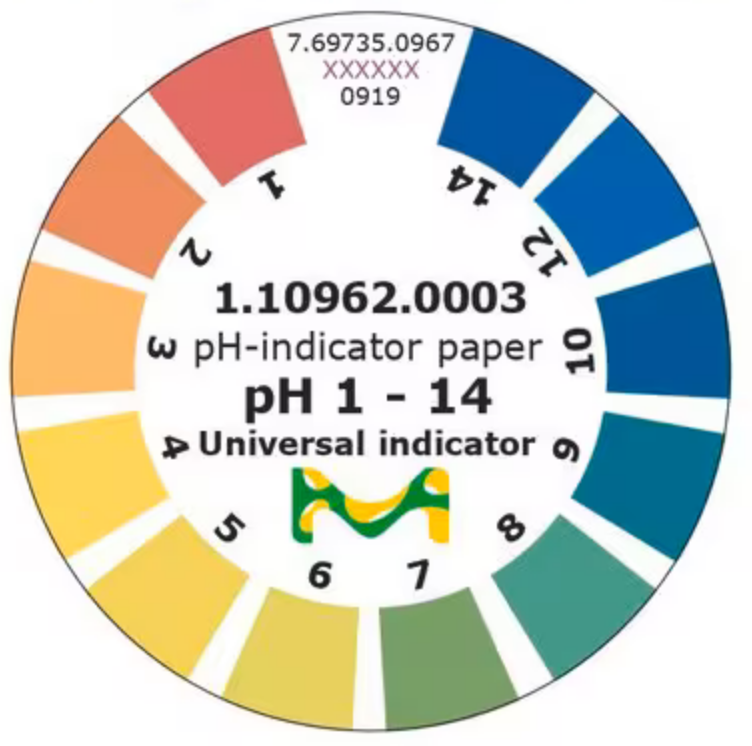
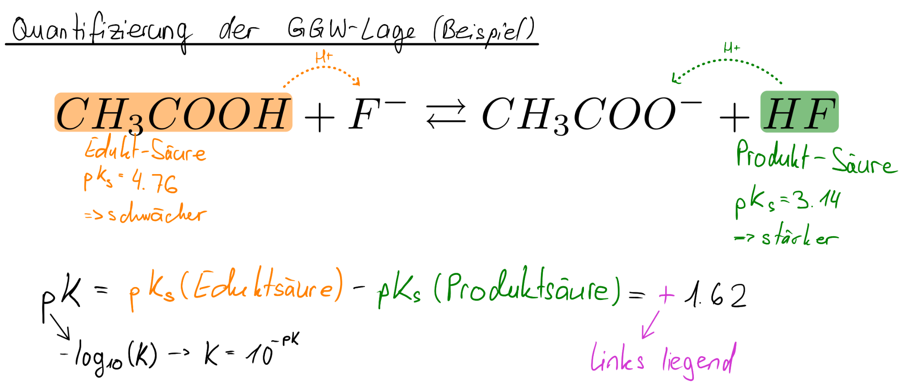

# Säuren und Basen

## Saure Lösungen

Eigenschaften:

- Reaktion mit **Indikatoren**: Indikatoren geben auskunft über den **pH-Wert** einer Säure
- Reaktion mit **unedlen Metallen**: Entstehung von **Wasserstoffgas**
- **Elektrische Leitfähigkeit**

!!! tip "Saure Lösungen $\neq$ reine Säuren"
    Saure _Lösungen_ sind in Wasser gelöst und deswegen auch leitfähig. _Reine_ Säuren liegen in ihrer puren Form vor und sind **nicht wasserlöslich**

    |                         | **Saure Lösung**                                   | **Säure**                                  |
    |-------------------------|----------------------------------------------------|--------------------------------------------|
    | **Stoffebene**          | Wässriges Stoffgemisch (aq)   Flüssigkeit   "Alltagsform" | Reinstoff (s, l, g)   "Chemikalie"      |
    | **Teilchenebene**       | $H_3O^+$-haltige wässrige Lösung (aq)   enthält auch $A^-$ (aq) | Molekül / mehratomiges Ion   $H^+$-Spender (polar gebunden) |

## Definition pH-Wert

Der pH-Wert _(**p**otentia **H**ydrogenii)_ misst die Konzentration von Hydroxonium-Ionen ($H_3O^+$) in einer Lösung.
Hier die Formeln dazu, wobei $c$ die Konzentration in mol pro Liter ist:

$$\text{pH} = -\log_{10}{\text{c($H_3O^+$)}}$$

$$\text{c(}H_3O^+\text{)} = 10^{-\text{pH}} \ \text{mol / L}$$

| pH-Wert | Bedeutung |
| :--: | :--: |
| $0-7$ | Sauer |
| $7$ | Neutral |
| $7-14$ | Basisch

## Indikatoren

- geben durch **veränderung ihrer Farbe** den **pH-Wert** einer Lösung an
- bestehen hauptsächlich aus **delokalisierten $\pi$-Systemen** und **funktionellen Gruppen**
- **alle** Indikatoren sind **ampholyten**[^1]

??? abstract "Farben des Indikatorpapiers (Universalindikator)"
    Das ist das Indikatorpapier, welches wir im Unterricht benutzt haben:
    

[^1]: Stoffe, welche sowohl als Säure als auch als Base agieren können

## Begriffe

**potentielle Säure**:

- Enthalten **positiv polarisierte** $H$-Atome
- $H^+$-**Spender**
- pH-Wert tiefer als 7

**potentielle Base**:

- Enthalten Stellen, wo ein $H^+$-Kation gebunden werden kann
    - negativ polarisierte ($\delta^-$) nichtbindende Elektronenpaare (nEPs)
    - negative partialladung
- pH-Wert über 7

!!! warning "Wann ist eine Säure _potentiell_?"
    Stoffe, welche als Säure funktionieren _könnten_, sind **potentielle** Säuren. Erst wenn eine Base hinzukommt, welche das abgegebene $H^+$-Ion aufnehmen könnte, wird der Stoff zu einer "echten" Säure. Dasselbe gilt natürlich umgekehrt auch für Basen.

**Ampholyt**:

- Stoff, der sowohl als Säure als auch als Base funktionieren kann
- ob er bevorzugt als Säure oder Base reagiert, hängt vom **Reaktionspartner** ab

**Konjugierte Säure**:

- "Gegenteil" einer Base
- ensteht durch das **wegnehmen** eines $H^+$-Ions
- doppelt konjugierte Säure &rightarrow; zwei $H^+$-Ionen wegnehmen

**Konjugierte Base**:

- "Gegenteil" einer Säure
- ensteht durch das **binden** eines $H^+$-Ions
- doppelt konjugierte Base &rightarrow; zwei $H^+$-Ionen binden

## Anorganische Säuren

### Chlorwasserstoff

- $HCl (g)$
- bildet in Wasser gelöst **Salzsäure** ($HCl (aq)$ beinhaltet $H_3O^+ (aq)$ und $Cl^-(aq)$)
- bildet mit Ammoniak ein weisses Salz (Feststoff)

### Schwefelsäure

- $H_2SO_4$
- löst sich im Wasser[^2]
- bildet mit Saccharose Schaum-artigen, $C$-haltigen stoff

[^2]: _"Erst das Wasser, dann die Säure, sonst geschieht das Ungeheure!"_

### Salpetersäure

- $HNO_3$
- starkes Oxidationsmittel &rightarrow; löst Kupfer auf

> Prozesse der Oxidation müssen wir für diese Prüfung nicht kennen

## Titration

???+ tip "Formel ins PSE eintragen!"
    Folgende Formel darfst du dir auf das Periodensystem notieren, falls du möchtest:

    $$
    c_{\text{Probe}} = \frac{c_{\text{Titrans}} \cdot V_{\text{Titrans}}}{V_{\text{Probe}}}
    $$

    in Einheiten:
    
    $$
    \frac{\text{mol}}{L} = \frac{\frac{\text{mol}}{L} \cdot L}{L}
    $$

- **Ziel**: Konzentration einer bekannten Säure oder Base herausfinden
- Formel für Konzentration gilt nur **am Äquivalenzpunkt**
- **Äquivalenzpunkt** &rightarrow; gleich viel Säure wie Base[^3]

[^3]: Das heisst aber nicht, dass pH = 7 gelten _muss_. Das wird durch die Stärke der Säure / Base beeinflusst. Es handelt sich hier nur um die gleiche **Stoffmenge** (in mol).

## Gleichgewicht

- je _kleiner_ der $pK_s$-Wert, desto _stärker_ die **Säure**
- je _grösser_ der $pK_s$-Wert, desto _stärker_ die **Base**
- $pK_s$-Wert wird immer für Säure gemessen (Basen nehmen den Wert ihrer konjugierten Säure)
- $pK = pK_s(\text{Eduktsäure}) - pK_s(\text{Produktsäure})$
- je **kleiner** der $pK$-Wert, desto **bevorzugter** läuft die Reaktion ab

??? abstract "Beispiel zur Ermittlung des Gleichgewichts"
    Hier reagiert $CH_3COOH + F^- \rightleftarrows CH_3COO^- + HF$, aber die Reaktion ist linksliegend aufgrund des positiven $pK$-Wertes:
    
