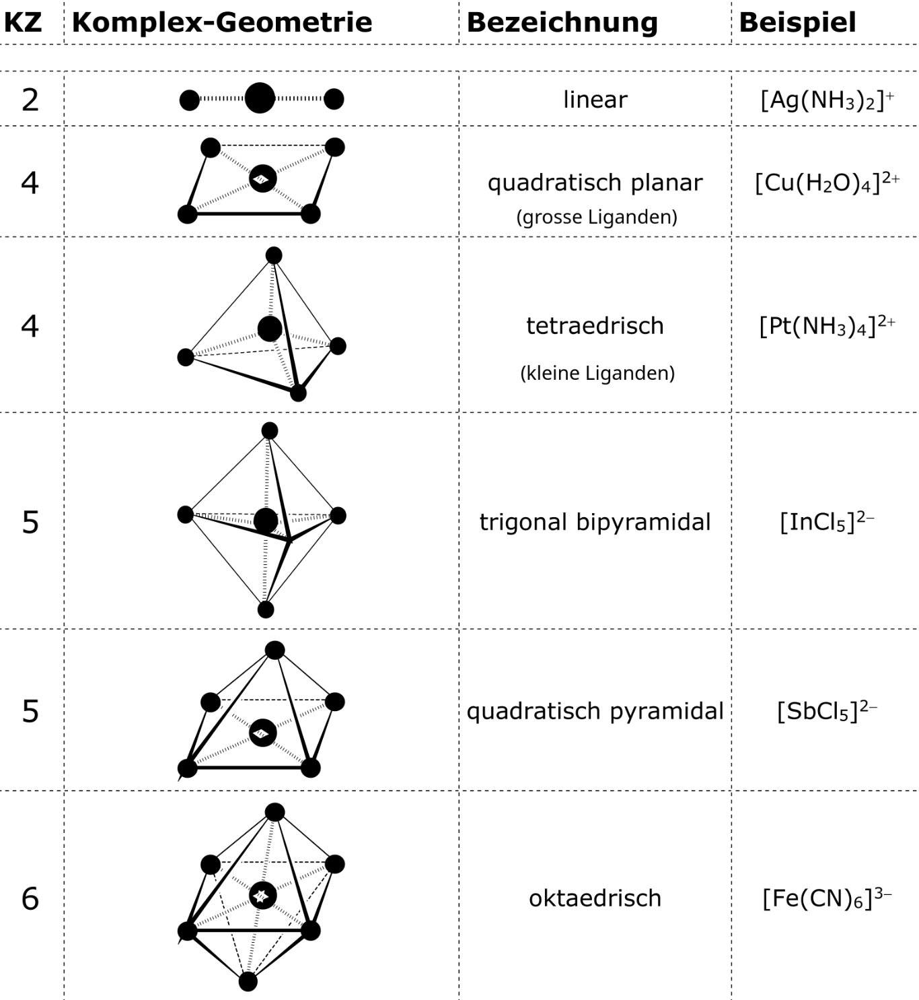

# Säuren & Basen, Komplex-R., Redox-R.

## Säuren & Basen

Säure*stärke*:

- **Tendenz** einer potentiellen Säure zur **Übertragung** von $H^+$ auf Wasser
- Messung mit dem $pK_S$-Wert
- unveränderbare Eigenschaft des Reinstoffes

Säure*grad*:

- **Konzentration** der Hydroxomium-Ionen ($H_3O^+$) in einer **wässrigen Probe**
- Messung mit dem $pH$-Wert
- veränderbare Eigenschaft der wässrigen Lösung

### Rechnen

$$\text{pH} = -\log_{10} c(H_3O^+) \quad \to \quad c(H_3O^+) = 10^{-\text{pH}}$$

??? example "Beispiel mit Lösungsweg zu pH-Berechnungen"
    **Aufgabe**: _Welcher pH-Wert stellt sich ein, wenn man 0.061 g Strontiumhydroxid in einem halben Liter Wasser löst?_

    - Strontiumhydroxid = $Sr(OH)_2$
    - molare Masse bestimmen:
        - $M(Sr) = 87.62\ \text{g/mol}$
        - $M(O) = 16\ \text{g/mol}$
        - $M(H) = 1.01\ \text{g/mol}$
        - $M(Sr(OH)_2) = 121.64\ \text{g/mol}$

    - Menge Strontiumhydroxid bestimmen:
        - $n = \frac{m}{M}$
        - $n(Sr(OH)_2) = \frac{0.061\ \text{g}}{121.64\ \frac{\text{g}}{\text{mol}}} \approx 5.01 \cdot 10^{-4} \cdot 10^{-4}\ \text{mol}$
    - Menge $OH^-$ bestimmen:
        - alle Bauteile von $Sr(OH)_2$ sind $5.01 \cdot 10^{-4}$ mol Mal vorhanden
        - $n(OH^-) = 2 \cdot 5.01 \cdot 10^{-4} \text{mol} = 1.00 \cdot 10^{-3} \text{mol}$
    - Konzentration von $OH^-$ bestimmen:
        - $c = \frac{n}{V}$
        - $c(OH^-) = \frac{1 \cdot 10^{-3}\ \text{mol}}{0.5\ \text{L}} = 2 \cdot 10^{-3}\ \frac{\text{mol}}{\text{L}}$
    - Konzentration von $H_3O^+$ bestimmen:
        - $c(H_3O^+) = \frac{\text{K}_{\text{W}}}{c(OH^-)}$
        - $c(H_3O^+) = \frac{10^{-14}\ \text{mol}^2\text{/L}^2}{2 \cdot 10^{-3}\ \text{mol/L}} = 5 \cdot 10^{-12}\ \text{mol/L}$
    - pH-Wert berechnen:
        - $\text{pH} = -\log_{10} c(H_3O^+)$
        - $-\log (5 \cdot 10^{-12}\ \text{mol/L}) = 11.3$

    &rArr; Der pH-Wert beträgt 11.3

**Faustregeln**:

> Die gelben Formeln im Skript dürfen ins Periodensystem eingetragen werden! (S. 25 SB-Skript)

- **starke Säure**:
    - $pK_S$ der Säure $\leq 0$
    - praktisch _jedes_ Säure-Teilchen reagiert mit Wasser, um $H_3O^+$ zu bilden
    - $c_0(HA) \approx c_{\text{eq}}(H_3O^+)$
    - $\text{pH} = -\log c_0(HA)$

- **starke Base**:
    - $pK_S$ der konjugierten Säure $\geq 14$
    - praktisch _jedes_ Base-Teilchen reagiert mit Wasser, um $OH^-$ zu bilden
    - $c_0(B^-) \approx c_{\text{eq}}(OH^-)$
    - $\text{pH} = -\log \frac{\text{K}_{\text{W}}}{c_0(B^-)}$

- **Base ist $O^{2-}$**:
    - $H_2O$ gibt ein $H$ ab &rarr; $2OH^-$ entsteht
    - $c_0(O^{2-}) = \frac{1}{2} c_{\text{eq}}(OH^-)$
    - $\text{pH} = \log \frac{\text{K}_{\text{W}}}{2\ \cdot\ c_0(O^{2-})}$

### Pufferlösungen

- dämpft Veränderung des pH-Wertes unter Zugabe von Säure oder Base
- wässrige Lösung mit SB-Paar $HA$ und $A^-$
- $HA$ ist eine **schwache Säure** &rarr; $pK_S$ zwischen 0 und 14
- $A^-$ ist die konjugierte Base von $HA$
- es gilt $\text{pH} = \text{pK}_{\text{S}}$, wenn $c(HA) = c(A^-)$

**Henderson-Hasselbalch-Gleichung** (Puffergleichung):

$$\text{pH} = \text{pK}_{\text{S}}(HA) + \log \frac{c(A^-)}{c(HA)}$$

> An der Prüfung kommen keine Berechnungen mit den Pufferlösungen.

- - -
## Komplex-Teilchen

### Aufbau

- **Zentral-Ion** in der Mitte
    - kleine Grösse
    - grosse Ladungsdichte
    - oft Übergangsmetall-Kationen
- **Liganden** regelmässig um das Zentral-Ion herum
    - Liganden haben nEPs[^1]
    - Alle potentiellen Basen sind somit auch potentielle Liganden
- **Komplex-Bindungen** _(= koordinative Bindungen)_ verbinden Zentral-Ion und Liganden
- **Koordinationszahl** _(KZ)_: Anzahl Liganden, welche ein Zentral-Ion haben kann

[^1]: **N**ichtbindendes **E**lektronen**P**aar

### Geometrien

- Anordnung der Liganden in unterschiedlichen Geometrien
- wird beeinflusst durch:
    - Ladung des Zentral-Ions
    - Grösse des Zentral-Ions
    - Grösse der Liganden

??? abstract "Tabelle zu den Geometrien von Komplex-Teilchen"
    2er, 4er und 6er-Geometrien sind für diese Prüfung wichtig, besonders die oktaedrische.

    

### Notation

Komplex-Ionen werden in **eckigen Klammern** gesetzt und tragen immer eine **Ladung**.

Innerhalb der Klammern:

1. Zentral-Ion _(ohne Ladung)_
2. anionische[^2] Liganden alphabetisch sortiert _(ohne Ladung)_
3. neutrale Liganden alphabetisch sortiert

[^2]: Mit einer negativen Ladung

 <!-- make sure the list below isn't also numbered -->

- mehrfaches Vorkommen eines Liganden &rarr; in **runde** Klammern mit Index
- ausserhalb der eckigen Klammern: **Gesamtladung**

??? example "Beispiele zur Notation von Komplex-Teilchen"
    - $[Fe(H_2O)_6]^{3+}$
    - $[CoCl_6]^{3-}$
    - $[FeSCN(H_2O)_5]^+$ oder $[Fe(SCN)(H_2O)_5]^+$, beides geht
    - $[AgClCN]^-$

### Komplex-Salze

- enthalten Komplex-Ionen als Bestandteile des Salzgitters
- Schreibweise: z.B $[CoCl_2(NH_3)_4]Cl$, wobei $Cl^-$ als Gegenion zu $[CoCl_2(NH_3)_4]^+$ wirkt
- Spezialfall **Kristallwasser**.
    - Wasser-Liganden sind im Komplex-Salz eingebaut
    - Schreibweise: z.B $CuSO_4 \cdot 5H_2O$

### Ligandenaustausch-Reaktionen

Reaktionen, bei denen Liganden eines Komplex-Ions ausgetauscht werden

Beispiele:

- $[Fe(H_2O)_6]^{3+} + Cl^- \rightleftarrows [FeCl(H_2O)_5]^{2+} + H_2O$
- $[Cu(H_2O)_4]^{2+} + 4\ NH_3 \rightleftarrows [Cu(NH_3)_4]^{2+} + 4\ H_2O$
- $[Cu(H_2O)_4^{2+} + 4\ Cl^- \rightleftarrows [CuCl_4]^{2-} + 4\ H_2O$
- $[Fe(SCN)(H_2O)_5]^{2+} + F^- \rightleftarrows [FeF(H_2O)_5]^{2+} + SCN^-$

- - -
## Redox-Reaktionen

- Übertragung von Elektronen
- **Reduktionsmittel** ($RM$) gibt elektronen ab[^3] und wird **oxidiert**
- **Oxidationsmittel** ($OM$) nimmt Elektronen auf und wird **reduziert**
- allgemeine Definition: $RM + OM \to RM^+ + OM^-$

[^3]: _"**R**aus **M**it den Elektronen"_

### Reaktionsgleichungen

???+ example "Typ 1 - Metall + Nichtmetall &rarr; Salzbildung"
    > So eine Aufgabe wird ganz sicher an der Prüfung kommen.

    **Edukte**: $Al\ (s) + Br_2\ (l)$

    **Teilchengleichungen**:

    - Oxidation: $Al - 3e^- \rightarrow Al^{3+}$
    - Reduktion: $Br + e^- \rightarrow Br^-$

    **Ionengleichung**:

    - $2Al + 3Br_2 \rightarrow 2Al^{3+} + 6Br^-$

    **Stoffgleichung**:

    - $2Al\ (s) + 3Br_2\ (l) \rightarrow 2AlBr_3\ (s)$

???+ example "Typ 2 - Metall / Nichtmetall + Salz"
    > Sofern nicht anders vermerkt an der Prüfung, darf die Edelgasregel für die Ionen angenommen werden.

    **Edukte**: $Fe\ (s) + CuSO_4\ (aq)$

    **Teilchengleichungen**:

    - Oxidation: $Fe - 2e^- \to Fe^{2+}$
    - Reduktion: $Cu^{2+} + 2e^- \to Cu$

    **Ionengleichung**:

    - $Fe + Cu^{2+} \to Fe^{2+} + Cu$

    **Stoffgleichung**:

    - $Fe\ (s) + CuSO_4\ (aq) \to FeSO_4\ (aq) + Cu\ (s)$

???+ example "Typ 3 - Nichtmetall + Salz"
    Diesen Reaktonstyp müssen wir für die Prüfung nicht direkt kennen, sondern wissen, dass hier ein Nichtmetall mit einem Salz reagiert.

???+ example "Typ 4 - Metall / Nichtmetall + molekularer Stoff"
    > Bei diesem Typ sind keine Ladungen offensichtlich, also muss die Redox-Reaktion anhand der Oxidationszahlen erkannt werden.

    **Edukte**: $2Mg\ (s) + CO_2\ (g)$

    **Teilchengleichungen**:

    - Oxidation: $Mg - 2e^- \to Mg^{2+}$
    - Reduktion: $O + 2e^- \to O^{2-} + C$

    **Ionengleichung**:

    - $2Mg + O_2 \to 2Mg^{2+} + 2O^{2-}$

    **Stoffgleichung**:

    - $2Mg\ (s) + CO_2\ (g) \to 2MgO\ (s) + C\ (s)$

### Oxidationszahlen

- zur Ortung der Bindungselektronen verwendet
- in römischen Zahlen angegeben
- wenn OZ sich verändern &rarr; immer eine Redox-Reaktion

**Grundregeln**: (gelten _immer_, erfordern aber teilw. Lewis-Formeln)

- **Elementarstoffe** haben immer OZ = 0
- einatomige Ionen &rarr; OZ entspricht **Ladung**
- Bindungselektronen werden dem **elektronegativeren** Atom zugeordnet (in Molekülen / Ionen)
- Summe der OZ im Molekül = **Gesamtladung**

**Faustregeln**: (gelten _meistens_, sind aber schnell anzuwenden)

- Hauptgruppen-Atome I, II, III &rarr; OZ +I, +II, +III respektive
- $H$-Atom in Verbindungen &rarr; OZ +I
- $O$-Atom in Verbindungen &rarr; OZ -II
- Halogen-Atome[^4] in Verbindungen &rarr; OZ -I

[^4]: Atome aus der 7. Hauptgruppe (= 7. Spalte im Periodensystem)
