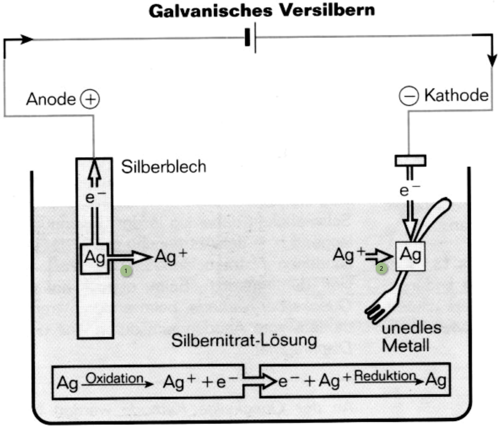
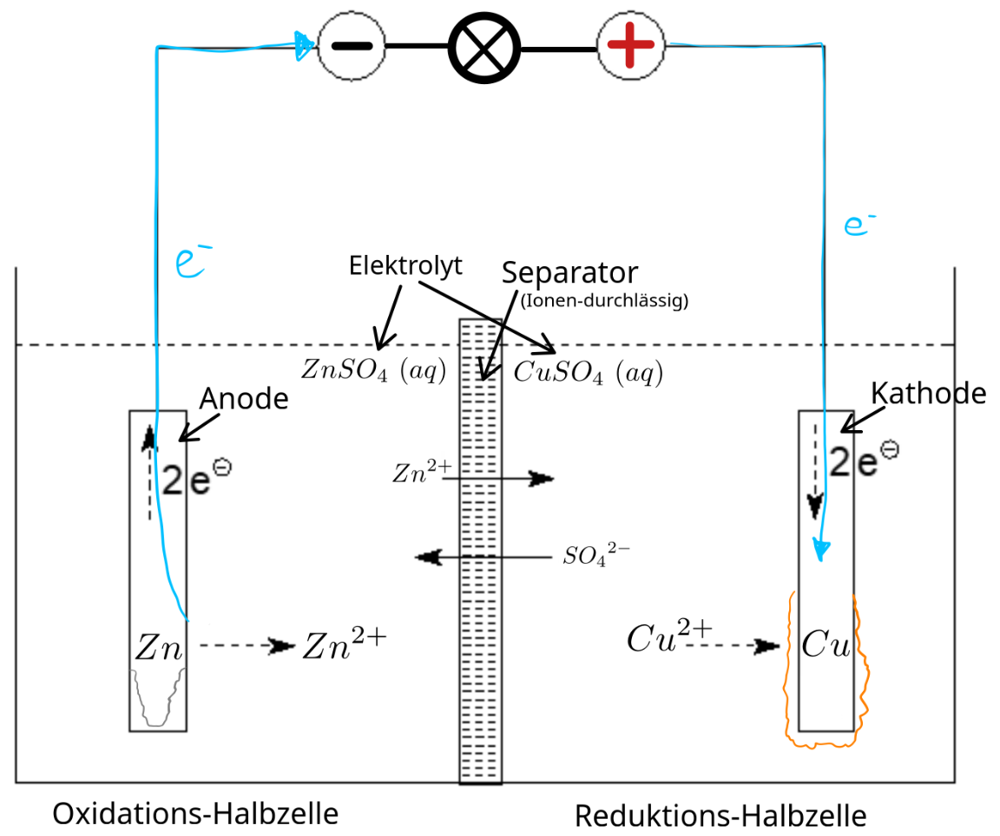
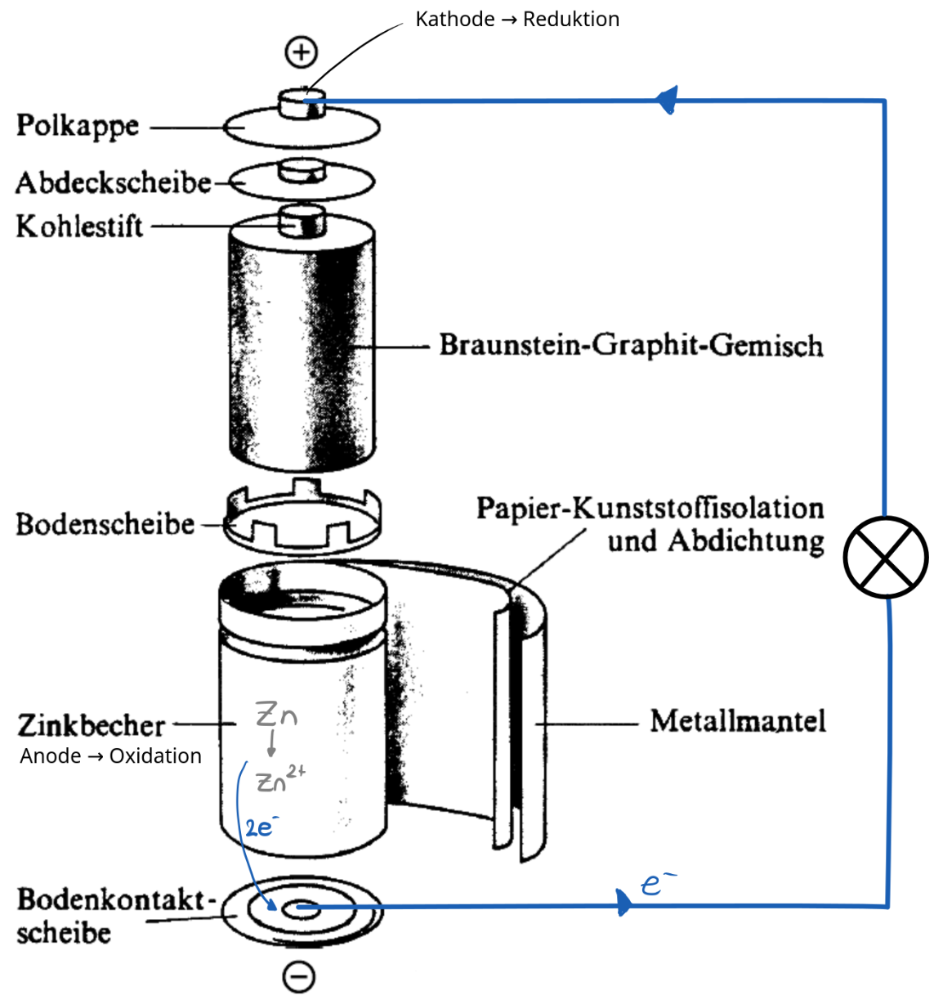
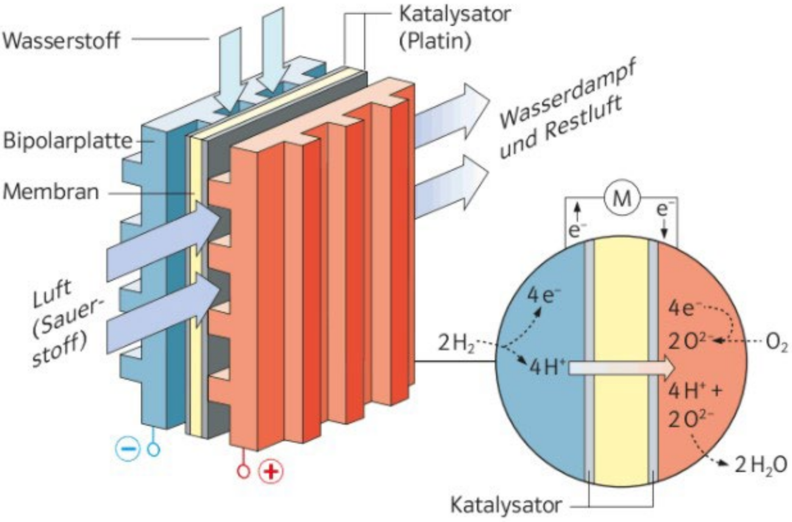

# Redox-Reaktionen II

## Repetition

- aus der [Ionentabelle](./ionentabelle.md) die **fettgedruckten** Ionen kennen
- [Einführung](../6/summary.md#redox-reaktionen) in die Redox-Reaktionen repetieren (inkl. Oxidationszahlen!)
- Nutzung der Redox-Reihe (siehe Aufgaben im Unterricht)

## Redox-Potential

- edle Metalle geben Elektronen nicht gerne ab
- unedle Metalle geben Elektronen gerne ab
- Quantifizierung durch **Reduktionspotential** $E$ (in Volt)
- grosses $E$ &rarr; edles Metall
- unter Normbedingungen[^1] **Normalpotential** ($E^0$) genannt
- **Redox-Potential** $\Delta E^0 = E^0(\text{OM}) - E^0(\text{RM})$
- freiwillige (rechtsliegende) Reaktionen (z.B. Korrosion) haben immer $\Delta E^0 > 0V$

[^1]: Normbedingungen: $T = 25\ \text{°C}\ ;\ p = 101'325\ \text{Pa}$

## Korrosion

- **Anode** wird **oxidiert** _(A und O)_
- **Kathode** wird **reduziert**
- das **un**edlere Metall ist die Anode _(oft Zink oder Eisen)_
- Elektronen gehen vom unedlen auf das edle Metall, da das edlere Metall ein schlechteres RM ist
- **Lokalelement**: Ort, an dem die Redox-Reaktion passiert[^2]
- funktioniert wie eine kurzgeschlossene galvanische Zelle

> Damit ein Lokalelement entsteht, müssen **zwei unterschiedlich edle Metalle** vorliegen. Auch in z.B einem Eisennagel ist das der Fall, da kleine Verunreinigungen, Kratzer oder Dichteunterschiede bereits einen genug grossen Unterschied machen, sodass sich eine Anode und eine Kathode bildet.

[^2]: Dafür sind eine Anode, eine Kathode und ein Elektrolyt nötig

### Opfer-Anode
- unedleres Metall wird mit edlem Metall verbunden
- unedles Metall wird zum Reduktionsmittel und korrodiert
- edles Metall bleibt intakt

## Elektrolyse
- durch elektrischen (gleich-)Strom erzwungene Redox-Reaktion
- reaktion, die eigentlich linksliegend ($\Delta E^0 < 0$) wäre, läuft trotzdem ab
- angelegte Spannung $U > |\Delta E^0|$ damit überhaupt Strom fliessen _kann_
- Elektronen fliessen von Anode zu Kathode

### Eloxieren von Aluminium
- Aluminium ist ein unedles Metall &rarr; anfällig für Korrosion
- Eloxieren erzeugt harte Schutzschicht aus Aluminiumoxid ($Al_2O_3$)
- Oxidschicht formt als poröse Schicht von hexagonal angereihten Röhren

!!! experiment "Ablaufende Reaktionen"
    Die **Anode** (in unserem Experiment der Stift) wird **oxidiert**: $Al - 3e^- \to Al^{3+}$

    An der **Kathode** wird **reduziert**: $2H_3O^+ - 2e^- \to H_2\ (g \uparrow) + H_2O\ (l)$

### Galvanisieren
> Elektrochemische Oberflächenbehandlung durch auftragen dünner Metallschichten; Hier am Beispiel des Versilberns aufgezeigt

Ausgangszustand:

- Anode (+): reines Silber ($Ag$)
- Kathode (-): zu beschichtendes Objekt aus unedlerem Metall
- Elektrolyt, welches bereits Silber-Ionen enthält (z.B. $AgNO_3$)
- Gleichspannungsquelle vorhanden ($U > | \Delta E^0$)

Vorgang:

1. **Oxidation** an der Anode:
    - Silberblech gibt Elektronen ab (wegen Spannungsquelle)
    - $Ag - e^- \to Ag^+$
2. **Reduktion** an der Kathode:
    - Spannungsquelle führt Elektronen zu
    - $Ag^+ + e^- \to Ag$
    - festes $Ag$ lagert sich ab

??? abstract "Diagramm zum galvanischen Versilbern"
    

## Galvanische Zellen
> Bei der Elektrolyse wird eine **linksliegende** Reaktion durch Strom _erzwungen_, bei der galvanischen Zelle (Batterie) wird eine **rechtsliegende** Reaktion genutzt, um Strom daraus zu erzeugen.

- RM und OM werden getrennt &rarr; Reaktion läuft nur dann ab, wenn Elektronen von RM zu OM fliessen können
- Elektronenfluss wird durch Anschluss eines Verbrauchers _(z.B. Glühbirne)_ ermöglicht
- Anode wird oxidiert &rarr; gibt ionen in den elektrolyt ab
- Kathode wird reduziert &rarr; Metall lagert sich an
- $U = \Delta E^0$

!!! info "Notation"
    Um festzuhalten, wie eine galvanische Zelle aufgebaut ist, verwendet man folgende Schreibweise:

    Anode $|$ Ion $||$ Ion $|$ Kathode

??? abstract "Darstellung eines Daniell-Elements"
    

    Notation: $Zn\ |\ Zn^{2+}\quad ||\quad Cu^{2+}\ |\ Cu$

    Spannung (Redox-Potential):

    $\Delta E^0 = E^0(OM) - E^0(RM)$

    $\Delta E^0 = E^0(Cu^{2+}) - E^0(Zn^{2+}) = 0.35\ V - (-0.76\ V) = 1.11\ V$

### Lechlanché-Element

> Auch _Kohle/Zink-Batterie_ oder _Trockenelement_ genannt

#### Aufbau

- Anode aus Zink &rarr; $Zn\ (s)$
- Kathode aus Mangan(IV)-oxid = Braunstein &rarr; $MnO_2\ (s)$
- beide Reaktanden sind fest &rarr; keine Trennwand nötig
- Anode und Kathode sind über Elektrolyt aus gelöstem Ammoniumchlorid verbunden &rarr; $NH_4Cl\ (aq)$

#### Vorgänge

1. Oxidation an der Anode
    - $Zn\ (s) - 2e^- \to Zn^{2+}\ (aq)$
    - Zinkbecher löst sich in diesem Prozess langsam auf
1. Bildung von Hydroxonium
    - ${NH_4}^+\ (aq) + H_2O\ (l) \rightleftarrows NH_3\ (aq) + H_3O^+\ (aq)$
    - Säure-Base-Reaktion im Elektrolyt
    - erzeugt das nötige $H_3O^+$ für die Reduktion
1. Bindung von Ammoniak
    - in (2) enstandenes Ammoniak könnte Gasblasen in der Batterie bilden
    - bindet an das Zentral-Ion Zink(II) und bleibt stabil in Lösung
    - $Zn^{2+}\ (aq) + 4NH_3\ (aq) \rightleftarrows [Zn(NH_3)_4]^{2+}\ (aq)$
1. Reduktion an der Kathode
    - $MnO_2\ (s) + H_3O^+\ (aq) + e^- \rightleftarrows MnO(OH)\ (s) + H_2O\ (l)$
    - beinhaltet SB-Reaktion $H_3O^+ + O^{2-} \to H_2O + OH^-$

Gesamte Reaktionsgleichung:

$Zn\ (s) + 2MnO_2\ (s) + 4NH_4Cl\ (aq) \rightleftarrows 2MnO(OH)\ (s) + [Zn(NH_3)_4]Cl_2\ (s) + 2HCl\ (aq)$

??? abstract "Darstellung eines Lechanché-Elements"
    

## Wasserstoff-Brennstoffzelle
> Spezielle Form einer galvanischen Zelle, bei der RM und OM **konstant von aussen zugeführt werden**

### Aufbau

- Wasserstoff ($H_2$) als Reduktionsmittel
- Sauerstoff ($O_2$) als Oxidationsmittel
- **PEM** _(**P**roton **E**xchange **M**embrane)_:
    - trennt RM und OM
    - lässt nur Protonen durch
    - mit Platin als Katalysator beschichtet _(auf beiden Seiten)_

### Vorgänge

1. Oxidation des Wasserstoffs
    - $H_2 - 2e^- \to 2H^+$
    - Elektronen gehen durch den Verbraucher
    - Protonen gehen durch PEM auf die andere Seite
1. Reduktion des Sauerstoffs
    - $O_2 + 4H^+ + 4e^- \to 2H_2O$
    - Wasser entsteht als Abfallprodukt

??? abstract "Darstellung einer Wasserstoff-Brennstoffzelle"
    "M" ist in der Darstellung ein Verbraucher (Motor)

    
