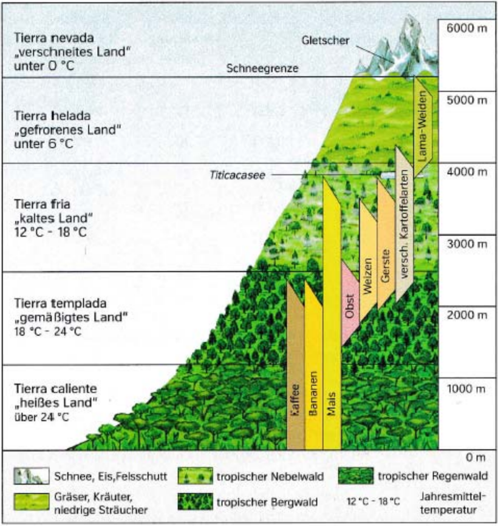
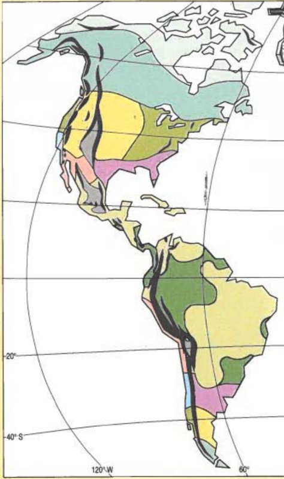
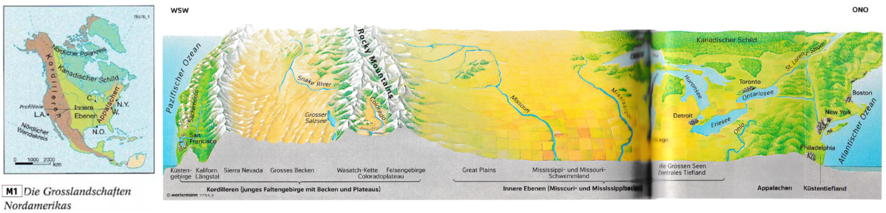

# Amerika

Name nach **Amerigo Vespucci**, der 1501 erstmals im heutigen Brasilien war. Zwar war Kolumbus vor ihm in der Karibik, aber Vespucci erkannte, dass es sich um einen neuen Kontinent handelt, nicht um Indien.

## Abgrenzungen

### Geografische Abgrenzung

- "Amerika" umfasst Nord-, Zentral- und Südamerika
- 2 Kontinente: **Nordamerika** und **Südamerika**
- Zentralamerika gehört zu Nordamerika
- Panama -> südlichstes Land in Nordamerika

### Kulturelle Abgrenzung

| Region        | Bestandteile                                | Sprachen                 |
| :------------ | :------------------------------------------ | :----------------------- |
| Angloamerika  | USA & Kanada + Kuba & Jamaika               | Englisch & Französisch   |
| Lateinamerika | Mittel- & Südamerika, ausser Kuba & Jamaika | Spanisch & Portugiesisch |

> Die Sprachen und Namen der Kulturerdteile gehen auf die **Kolonialmächte** zurück, welche die jeweiligen regionen kolonisierten. _(England, Frankreich, Spanien, Portugal)_

## Landschaftliche Gliederung

### Horizontale Gliederung

> Mit "horizontal" ist gemeint, dass die Gliederung einer Region analysiert wird, wie sie in Nord-Süd-Richtung verläuft, also auf unterschiedlichen Breitengraden.

- Nordamerika -> stärker gegliederte Küstenlinie als Südamerika (z.B. Fjorde, Buchten, Meeresärmel)
- Ostküste Nordamerikas ist besonders stark unterteilt
- Küstenform eignet sich gut für den Bau von Naturhäfen

### Vertikale Gliederung

> Mit "vertikal" ist gemeint, dass die Gliederung einer Region analysiert wird, wie sie in Ost-West-Richtung verläuft, also auf unterschiedlichen Längengraden.

|                            |             Westen             |               Zentrum                |              Osten               |
| :------------------------: | :----------------------------: | :----------------------------------: | :------------------------------: |
|       Landschaftstyp       | Faltengebirge (Hochgebirge) |      Tiefland (Schwemmland)       | Rumpfgrbirge (Mittelgebirge)  |
| Beispiele (Nordamerika) |  Rocky mts. Küstengebirge   | Mississippi-Tiefland Great Plains | Appalachen Kanadischer Schild |
| Beispiele (Südamerika)  |             Anden              |            Amazonasbecken            |     Brasilianisches Bergland     |

## Landwirtschaft nach Höhe

Typische landwirtschaftliche Nutzungsformen nach Höhe **in den Anden**:

__

## Klima & Vegetation

__

- Nordamerika (Kanada): **Tundra & Nadelwald**
- Nordamerika (USA): **Laubwald & Steppe**
- Mittelamerika: **Tropen & [Lorbeerwald](https://de.wikipedia.org/wiki/Lorbeerwald)**
- Südamerika (richtung Norden): **Savanne & trop. Regenwald**
- Südamerika (richtung Süden): **Lorbeerwald & Steppe**

> Westküsten von Amerika (besonders Kalifornien, zentrales Chile) -> **Mittelmeerklima**. Südlich von Chile auch **Nadelwälder**.

## Relief

Zusätzliche / generelle Infos zur amerikanischen Landschaft sind [hier auf klett.de](https://www2.klett.de/sixcms/list.php?page=Infothek_artikel&extra=Haack+Weltatlas-Online&artikel_id=108679&inhalt=klett71prod_1.c.139752.de) zu finden.

__

Die wichtigsten Gebirge der Amerikas:

- **[Kanadischer Schild](https://de.wikipedia.org/wiki/Kanadischer_Schild#/media/Datei:Canadianshield.gif)**: Altes Rumpfgebirge in Kanada (400~500 m ü. M)
- **Appalachen**: Südlich vom Kanadischen Schild (bis zu 2'000 m. ü. M.)
- [**Kordilleren**](https://en.wikipedia.org/wiki/American_Cordillera#/media/File:American_cordillera_map.png): Gebirgskette bis zur Südspitze Chiles
  - **Küstengebirge**: Direkt an der Westküste Kaliforniens (ca. 1'800 m ü. M)
  - **Rocky mountains**: Höchste Gebirgskette Amerikas (bis zu 5'000 m ü. M)
  - **Anden**: Gebirgskette [entlang der Westküste Südamerikas](https://upload.wikimedia.org/wikipedia/commons/f/f8/Locator_Map_of_The_Andes.png) (bis zu 7'000 m ü. M.)

> In den Arbeitsblättern waren mehr Gebirge als hier aufgeführt. Das sind die Informationen von denen ich persönlich denke, dass sie am Test wichtig sein könnten. Es sind aber nicht alle, du wurdest gewarnt :)

## Besiedlungsgeschichte

Unterschiedliche Faktoren spielen bei der Migration eine Rolle:

- **Push**-Faktoren bewegen Menschen dazu, ihren aktuellen Wohnort zu verlassen um zu _emigrieren_

  - Kriege, Hungersnöte, Not
  - religiöse / politische Verfolgung
  - soziales Gefälle, Arbeitslosigkeit
  - usw.

- **Pull**-Faktoren ziehen Menschen zu einem Ort, sodass sie da _immigrieren_
  - soziale Sicherheit
  - Akzeptanz in der Gesellschaft
  - höhere Gehälter, Arbeitskräftebedarf
  - usw.

### Bevölkerungsgruppen

- **Europäer** (Weisse): Kolonialisierten den gesamten Amerikanischen Kontinent in den letzten 400 Jahren
- **Afroamerikaner** (Schwarze): Als Sklaven im 18./19. Jh. nach Amerika verschleppt; heute in USA, Karibik, (kleine Antillen) und an brasilianischer Küste
- **Asiaten**: Als billige Arbeitskräfte benötigt im 19. Jh.; vorwiegend an der Pazifikküste konzentriert oder an Stützpunken früherer Kolonialmächte
- **Hispanics** (Latinos): Spanisch sprechende Einwanderer, in US-Bundesstaaten des Südens und Südwestens

---

USA heute:

- mehr als **170 ethnische Gruppen** in USA
- viele einwanderer aus Südamerika (Hispanics / Latinos)
- Mexico als Hauptherkunftsland der ausländischen Amerikanischen Einwohnern

### Hochkulturen

| Bezeichnung                  | Blütezeit                                    | Verbreitungsgebiet                                          | Merkmale, Besonderheiten, Errungenschaften, etc.                                                                                                                                                                                                                      |
| ---------------------------- | -------------------------------------------- | ----------------------------------------------------------- | ---------------------------------------------------------------------------------------------------------------------------------------------------------------------------------------------------------------------------------------------------------------------------------- |
| **Anasazi** ("ancient ones") | 200 - 1450 n. Chr. (ab 750 Pueblo-Kultur) | Colorado, Arizona, New Mexico ("Chaco Canyon") | - Architektur -> "Cliff Dwellings" = mehrstöckige Stein-Pueblos aus Luft-/Sonnenggetrockneten Adobe-Lehmziegeln - Ackerbau -> Mais, Kürbis, Bohnen - Handwerk -> Töpfern, Weben, Körbe flechten _Adobe-Lehmziegel = Geschichtete luftgetrocknete Lehmziegel_ |
| **Azteken**                  | 1100 - 1521 n. Chr.                          | zentrales Mexico                                            | - Architektur -> Pyramiden und Tempel - aggressives Kriegervolk mit grausamem Opferkult - Menschenopfer für Götter & Abschreckung / Einschüchterung                                                                                                                          |
| **Mayas**                    | 300 - 900 n. Chr.                            | Yucatan-Halbinsel                                           | - Die "Griechen Amerikas" wegen Astronomie, Zeit, Kunst etc. - Architektur -> Tempel auf gestuften Pyramiden im Urwald - Konkurrierende Stadtstaaten                                                                                                                         |
| **Inkas**                    | 1100 - 1532 n. Chr.                          | Südamerika (Chile, Argentinien etc.)                        | - Ackerbau -> künstliche Terrassierung & Bewässerung - grosse Getreidespeicher - "Römer Amerikas" -> Verwaltung, Strassen, Bergbau, etc. - Sonnenkult _("Inka" = der Herrscher; Sonnengott)_                                                                              |
