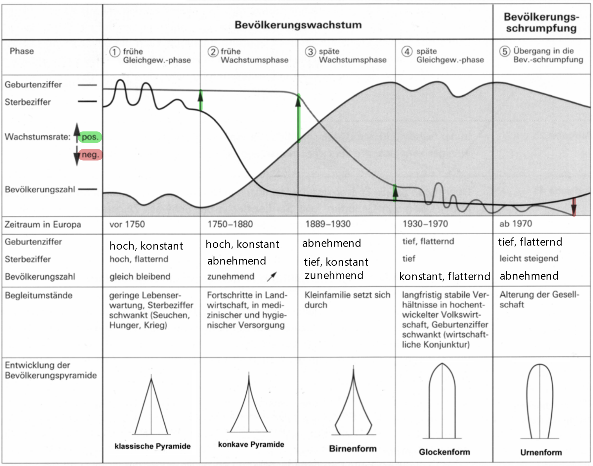

# Demographie

## AHV-Problem

### AHV
- **A**lters- und **H**interlassenen**v**ersicherung
- obligatorische Versicherung
- deckt Existenzbedarf im Alter
- **1. Säule** des Dreisäulensystems

### Babyboomer
- während der **Nachkriegszeit** (~1950) in einer Zeit grossen Optimismus geboren
- viele Geburten, die jetzt in die Rente gehen

### Situation
- Menschen arbeiten **über das Rentenalter hinaus**, um sich versorgen zu können
- immer **weniger Arbeiter pro Rentner**
- AHV-Zahlungen durch Arbeitnehmer müssten **steigen**, damit alle Rentner versorgt sind

## Kenngrössen der Bevölkerungsentwicklung
- **allgemeine Geburtenrate** / -Ziffer: gemessen in $\frac{\text{Geburten}}{1000 \text{ Einwohner}}$
- **spezifische Geburtenrate** / -Ziffer: wie allgemeine Geburtenrate, aber für eine **spezifische Kategorie** (z.B. Geschlecht des Kindes)
- **allgemeine Sterberate** (a.k.a Sterbeziffer): gemessen in $\frac{\text{Todesfälle}}{1000 \text{ Einwohner}}$
- **spezifische Sterberate** /-Ziffer: wie allgemeine Sterberate, aber für eine **spezifische Kategorie** (z.B. Geschlecht, Alter)
- **natürliches Bevölkerungswachstum**: Allgemeine Geburtenrate $-$ Allgemeine Sterberate &rightarrow; zeigt Zu- / Abnahme der Bevölkerung, **ohne Migration** zu berücksichtigen
- **Wanderungssaldo**: durch Migration bedingte Veränderungen der Bevölkerung
    - negativ &rightarrow; **E**migration überwiegt
    - positiv &rightarrow; **Im**migration überwiegt
- **tatsächliches Bevölkerungswachstum**: natürliches Bevölkerungswachstum $+$ Wanderungssaldo
- **jährliche Zuwachsrate**: Zuwachs als Faktor oder Prozent der Bevölkerung zum Jahresbeginn ($\frac{\text{Ende} - \text{Anfang}}{\text{Anfang}}$)
- **Allgemeine Fruchtbarkeitsrate**: Häufigkeit des Mutterwerdens &rightarrow; Kinder pro Frau zwischen 15-45 J
- **Ersatzniveau**: Bei $2.13$ Kinder / Frau bleibt das **natürliche** Bevölkerungswachstum Null
- **Altersaufbau**: Anteil der Bevölkerung mit einem Bestimmten Alter &rightarrow; Grundlage für die [Alterspyramide](#Bevölkerungsentwicklung)
- **Allgemeine Lebenserwartung**: Lebenserwartung bei **Geburt**
- Lebenserwartung bei 65 Jahren
- **Verdoppelungszeit**: Jahre, bis sich die Bevölkerung verdoppelt &rightarrow; $\frac{70}{\text{natürliche Wachstumsrate in }\%}$

## Bevölkerungsentwicklung

??? abstract "Grafik zur Bevölkerungsentwicklung"
    
    
1. *frühe Gleichgewichtsphase*: vorindustrielle Gesellschaft
    1. Hungersnöte, Kriege usw. &rightarrow; Volatile Geburten- & Sterberaten
    2. Nur wenige Kinder überleben &rightarrow; **Reproduktionszwang**
    3. heute keine Länder in dieser Phase mehr
2. *frühe Wachstumsphase*: verbesserte Lebensbedingungen
    1. Fortschritte in Hygiene, Landwirtschaft, Medizin usw. &rightarrow; **sinkende Sterberate**
    2. **Lebenserwartung steigt**
    3. Grosse Differenz zwischen Geburten- & Sterberate &rightarrow; **Bevölkerungsschere**
    4. Bevölkerungsschere &rightarrow; starker Anstieg der Bevölkerungszahl
    5. Länderbeispiel: Afghanistan (Stand 2014)
3. *späte Wachstumsphase*: Kinder werden weniger essenziell
    1. weitgehend erhöhte Lebensstandards &rightarrow; Kinder werden nicht mehr als **Helfer & Altersvorsorge** gebraucht
    2. Kinder werden **Wirtschaftlich ungünstig** in industriellen Gesellschaften
    3. Kleinfamilie wird zunehmend zum Ideal &rightarrow; **Geburtenrate sinkt**
    4. Bevölkerungsschere schliesst langsam wieder
    5. Länderbeispiel: Marokko (Stand 2014)
4. *späte Gleichgewichtsphase*: Wirtschaft diktiert Geburtenrate
    1. Geburten- & Sterberate sind niedrig &rightarrow; Bevölkerungswachstum stoppt
    2. **Wirtschaftliche Schwankungen** &rightarrow; volatile Geburtenrate
    3. Länderbeispiel: Argentinien (Stand 2014)
5. *Bevölkerungsschrumpfung*: Geburtenrate $<$ Sterberate
    1. weniger Geburten als Todesfälle &rightarrow; **sinkende Bevölkerungszahl**
    2. in vielen Ländern durch **Zuwanderung** ausgeglichen
    3. Länderbeispiel: Deutschland

## Chinas Einkindpolitik

### Wirtschaft & Politik

- gesetzliches Limit von **einem Kind pro Familie**
- **Reduzierung des Bevölkerungswachstums** wegen begrenzter Ressourcen
- führt zu **Wirtschaftswachstum** & mehr Investitionen in Bildung
- **Arbeitskräftemangel**

### Demografische Auswirkungen

- **schrumpfende Bevölkerung:** Geburtenrate sank drastisch (ca. 1,5 Kinder/Frau).
- **alternde Gesellschaft:** Anteil älterer Menschen steigt (2050: ~30 % über 60).
- Geburtenrate **bleibt tief**, trotz gesetzlicher Lockerungen (3-Kind-Politik seit 2021)

## Demografische Dividende

- Zusammenhang zwischen Demografie und Wirtschaft
    - Korrelation zwischen **verlangsamten Bevölkerungswachstum** und **gesellschaftlichem Wohlstandsgewinn**
    - Messung anhand von **Bevölkerungswachstumsrate** und **Veränderung des BNE[^1] pro Kopf**
- Kinder & Senioren sind **finanziell abhängig** von Arbeitnehmern
- Staaten spenden viele Ressourcen auf Kinder & Senioren &rightarrow; **Herausforderung für Sozial- & Wirtschaftssystem**
- Staaten mit vielen Arbeitnehmern haben weniger Kosten für Schulen, Alteneinrichtungen usw.
    - Sprunghafter Anstieg des BNE &rightarrow; mehr Geld für andere Bereiche *(z.B Infrastruktur)*
    - hohe Chance auf wirtschaftlichen Erfolg

[^1]: **B**rutto**n**ational**e**inkommen

Beispiele:

- **Bangladesch**: starke Korrelation -> Bevölkerungswachstumsrate sinkt mit der Zunahme des Bruttonationaleinkommens
- **Thailand / Südkorea**: weniger deutlich -> Asien-Krise (1997/98) hat Schwankungen verursacht
