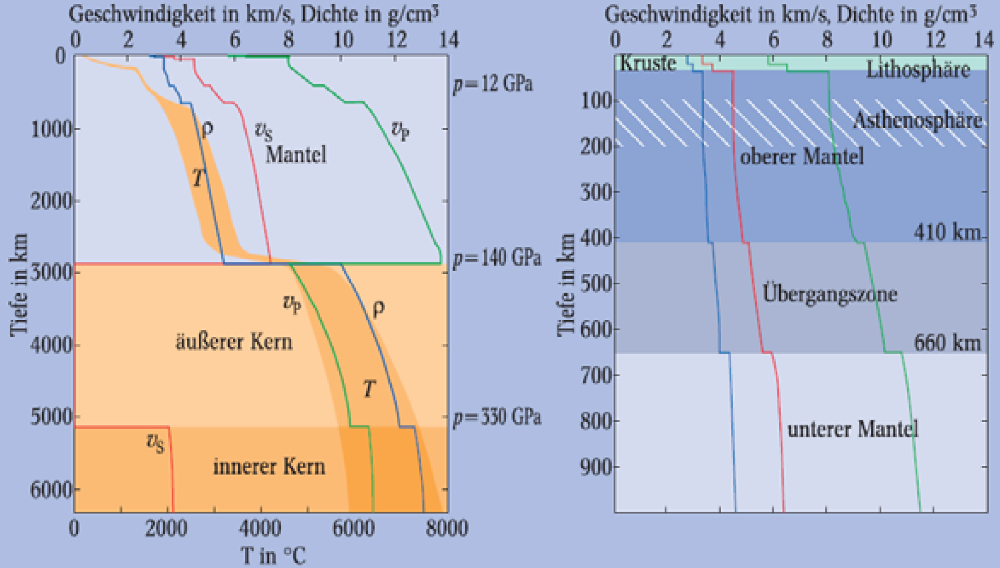
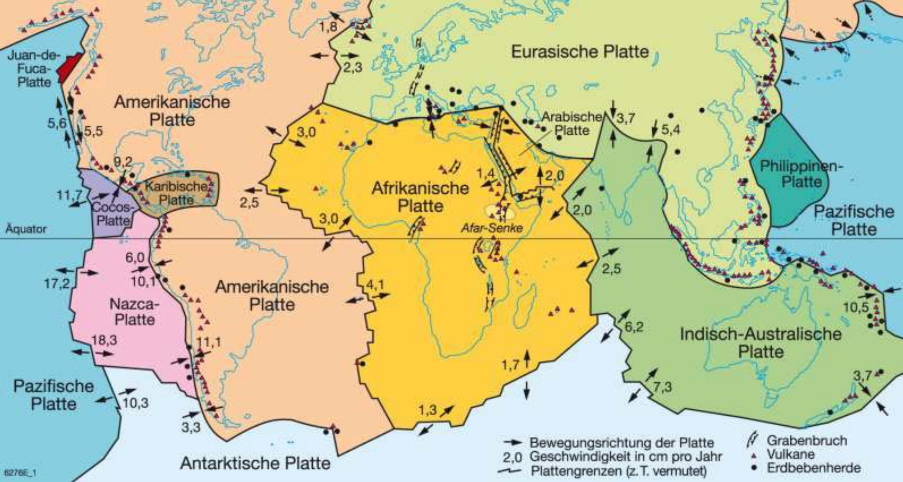
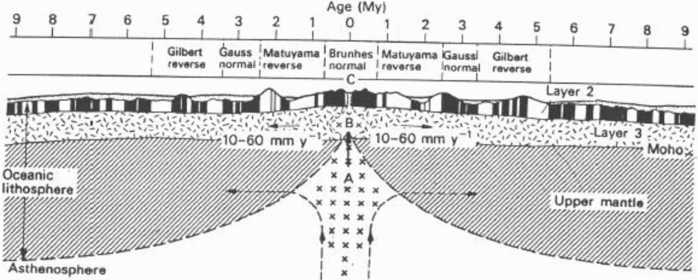
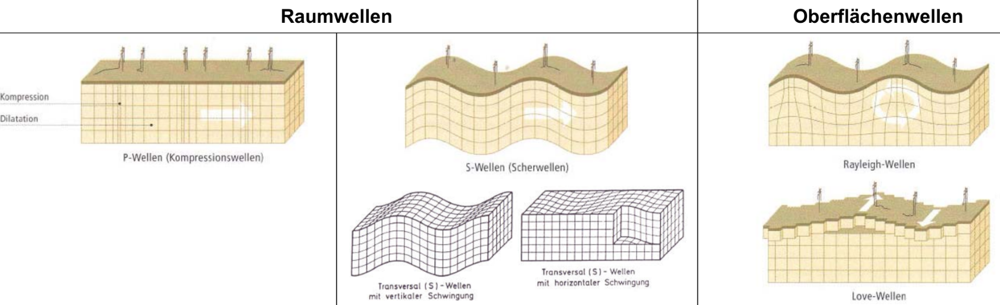
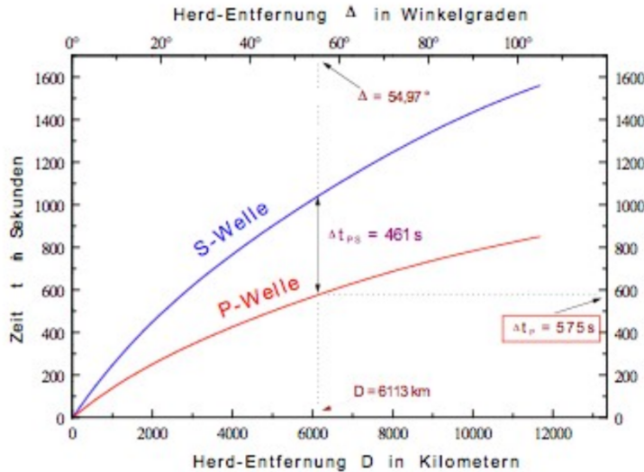

# Geologie, Plattentektonik & Erdbeben

!!! warning "Nicht alles ist hier drin"
    Da es schon sehr viel Stoff ist, habe ich jetzt mal das priorisiert, was ich persönlich wichtig fand. Es waren aber auch noch andere Unterthemen in den Lernzielen, die hier nicht aufgeführt sind.

## Gesteinsklassifikation

- **Ablagerungs-** oder **Sedimentgesteine**:
    - Produkt der Verwitterung anderer Gesteine
    - Enstehung durch **Verfestigung** von Lockergesteinsformen[^1]
    - Bsp.: Tonstein, Sandstein, Kalkstein, Konglomerat

- **Erstarrungs-** oder **Magmatische** Gesteine:
    - Magma steigt auf und kühlt ab
    - langsame Abkühlung tief in Erdkruste &rarr; **Tiefengesteine** _(Granit, Gabbro)_
    - Abkühlung weiter oben in Erdkruste &rarr; **Ganggesteine** _(Dolerit)_
    - Austritt als Lava &rarr; **Oberflächengesteine** _(Basalt)_

- **Umwandlungs-** oder **Metamorphe** Gesteine:
    - Entstehung aus Erstarrungsgesteinen oder Sedimentgesteinen
    - hoher Druck und Temperatur bei der Bildung
    - oft **geschiefert** _(in Lagen gegliedert, [Beispielfoto][schieferung])_

[^1]: Ton, Sand, Kies, Silt usw.
[schieferung]: https://de.wikipedia.org/wiki/Schieferung#/media/Datei:Schiefer_anstehend.jpg

- - -
## Weltentstehungsmodell

1. vor **13 Milliarden Jahren**: Urknall bewirkt Entstehung des Universums
1. Staub und Gas kühlt ab, Enstehung des **Solaren Nebels**
1. Sonnensystem entsteht aus Solarem Nebel
1. vor **4.6 Milliarden Jahren**: Masse wird dichter &rarr; erste Planeten _(Protoplaneten)_ entstehen
1. Aufheizung der Erde durch **Meteoriteneinschläge**, **Kompression durch das Eigengewicht** und **radioaktiver Strahlung**
1. schwere Elemente sinken zum Erdkern, leichte Elemente formen die Kruste &rarr; **schalenförmiger Aufbau**

## Schalenaufbau Erde

**Erdkruste**

- besteht praktisch aus nur 8 Elementen
- **Dicke**: 30-50 km _(kontinentale Kruste)_ bzw. 5-10 km _(ozeanische Kruste)_
- **Druck**: bis zu 15 kbar
- **Temperatur**: bis zu 1100 °C

> Die Extremwerte für Druck und Temperatur gelten natürlich an der Untergrenze der Erdkruste

**Oberer Erdmantel**

- oberste Schicht + Erdkruste = **Lithosphäre**
- **Asthenosphäre**: Gesteine schmelzen teilweise _(~1-5%)_ &rarr; zähplastische Fliesszone
- **Dicke**: ca. 700 km
- **Druck**: 300-500 kbar
- **Temperatur**: 1200-1500 °C

**Unterer Erdmantel**:

- sehr hoher Druck &rarr; **festes Gestein**
- **Dicke**: ca. 2200 km
- **Druck**: 1000-1400 kbar
- **Temperatur**: 1900-3700 °C

**Äusserer Erdkern**:

- flüssig
- besteht aus Metallen _(Eisen & Nickel)_
- Fliessbewegungen der Metalle erzeugen Magnetfeld &rarr; Schutz vor kosmischer Strahlung
- **Dicke**: ca. 2200 km
- **Druck**: 2500 kbar
- **Temperatur**: 4000 °C

**Innerer Erdkern**:

- fest aufgrund hohen Druckes
- **Dicke**: ca. 1200 km
- **Druck**: 3600 kbar
- **Temperatur**: 5000 °C

???+ abstract "Tabelle: Zahlenwerte zum Schichtenaufbau"
    | Schicht | Obergrenze [km] | Untergrenze [km] | Mächtigkeit [km] | Mächtigkeit im Massstab 1:100'000'000 | Zustand | Temperatur (Bereich) | Volumen | Masse |
    |---|---|---|---|---|---|---|---|---|
    | Erdkruste | 0 | 45 | 45 | 0.045 cm | fest (starr) | meist < 800 °C | 1% | 0.5% |
    | Erdmantel | 45 | 2900 | 2855 | 2.855 cm | fest / zähplastisch | 1000–3000 °C | 84% | 67% |
    | Äusserer Kern | 2900 | 5150 | 2250 | 2.250 cm | flüssig | 3000–5000 °C | 14.5% | 30% |
    | Innerer Kern | 5150 | 6370 | 1220 | 1.220 cm | fest | 5000–7000 °C | 0.5% | 2% |

### Belege für den Schalenaufbau

- Messung der Ausbreitung von seismischen Wellen
- S- und P-Wellen haben je nach Schicht unterschiedliche Ausbreitungsgeschwindigkeiten
- Erdschalen werden an **Diskontinuitäten** getrennt &rarr; schlagartige Änderung der Ausbreitungsgeschwindigkeiten

??? abstract "Diagramm zu T, p, $\rho$ und $v$"
    Anmerkungen:

    - $v_P$ = Geschwindigkeit der Primärwellen _(Kompressionswellen)_
    - $v_S$ = Geschwindigkeit der Sekundärwellen _(Scherwellen)_
    - S-Wellen können sich in Flüssigkeiten nicht ausbreiten
    
    

## Plattentektonik

> Spektrum hat ein hilfreiches [Erklärvideo](https://www.youtube.com/watch?v=WTwou-Cf7u4) zum Thema gemacht

??? abstract "Karte der tektonischen Platten"
    - Konvektionsströmungen in der Asthenosphäre bewegen darauf liegende tektonische Platten
    - Platten bewegen sich ca. 1-10 cm pro Jahr
    
    

### Plattengrenzen

**3 Typen von Plattengrenzen**:

- **divergierend** / konstruktiv: bewegen sich von einander weg
- **konvergierend** / destruktiv: bewegen sich auf einander zu
- **Transformstörung** / konservativ: bewegen sich an einander vorbei

**Vorgänge**:

- wenn Platten irgendwo divergieren, müssen sie auch irgendwo konvergieren
- **Spreizungszonen**:
    - Magma steigt aus Erdmantel auf &rarr; Bildung neuer Erdkruste
    - Entstehung von Mittelozeanischen Rücken, Riftzonen[^2], Vulkanen oder Flachbeben[^3]
- **Subduktionszonen**:
    - dichtere ozeanische Platte taucht unter kontinentale Platte ab
    - Gestein schmilzt teilweise auf &rarr; Bildung von Magma
    - Magma wird über Vulkane an die Öberfläche gebracht
    - Entstehung von Tiefseegräben, starken Erdbeben, Gebirgen oder Inselbögen
- **Kollisionszonen**:
    - Zusammenstoss zweier konvergierender Platten gleicher Dichte
    - Gestein wird zusammengedrückt und aufgefalten &rarr; Entstehung von **Hochgebirgen**
    - Ursache für starke Flachbeben
- **Transformzonen**:
    - Platten bewegen sich seitlich an einander vorbei
    - Platten Verhaken sich und lösen sich plötzlich wieder
    - Ursache für Erdbeben oder Risse bzw. [Verwerfungen](https://de.wikipedia.org/wiki/Verwerfung_(Geologie)) in der Erdoberfläche

[^2]: Gräben, die an divergierenden Plattengrenzen _(= Spreizungszonen)_ entstehen
[^3]: Erdbeben, deren Herd weniger als **70 km** unter der Erdoberfläche liegt

### Seafloor Spreading

- auseinander driftende _(divergierende)_ tektonische Platten
- im entstehenden Spalt kommt neues Gestein hoch
- Meeresboden wird erneuert
- kontinentale Platten sind viel älter als ozeanische

### Magnetstreifenmuster

- Basalte auf dem Ozeanboden sind unterschiedlich magnetisiert
- beim Austritt des Magmas &rarr; Ausrichtung nach Erdmagnetfeld
- Entstehung unterschiedlich polarisierter Basaltstreifen
- Hinweis auf Umpolung der Erde

??? abstract "Diagramm der Magnetstreifenmuster"
    

### Wilson-Zyklus

> Der Wilson-Zyklus beschreibt die Entstehung von Ozeanen in drei groben Stadien. So ist auch der Atlantische Ozean entstanden.

1. **Graben-** oder **Rift-Stadium**:
    - aufsteigendes Magma (**= Mantle Plume**) wölbt Erdkruste
    - Kruste reisst auf &rarr; **Grabenbruch** entsteht
    - Vulkane treten an der Oberfläche auf
2. **Rotes-Meer-Stadium**:
    - Graben weitet sich aus, Wasser dringt rein
    - Entstehung eines kleinen Meeres
    - Graben driftet immer noch aus einander
3. **Atlantik-Stadium**:
    - Meer hat sich zu Ozean entwickelt
    - **Mittelozeanischer Rücken** (MOR) mit bis zu 3 km Höhe
    - ozeanische Kruste wächst vom MOR aus in beide Richtungen (siehe [seafloor spreading](#seafloor-spreading))

## Kohlebildung

1. Ablagerung von totem Material in stehenden Gewässern
1. Sauerstoffabschluss (**anaerobe** Bedingungen) &rarr; Kohlesümpfe (Moore)
1. rasche Überlagerung durch dicke Sedimentschichten
1. *bio*chemische Umwandlung des organischen Materials durch anaerobe Bakterien
1. *geo*chemische Umwandlung durch Kompaktion über lange Zeit (hohe Druck- und Temperaturbedingungen)

Dabei liegt Kohle in unterschiedlichen Formen vor, die im Verlauf des Prozesses der **Inkohlung** entstehen:

- **Torf**: zusammengepresste kohlenstoffhaltige Organismenreste
- **Braunkohle** (Lignit): noch erkennbare Pflanzenstrukturen
- **Steinkohle**: nahezu keine Reste mehr
- **Anthrazit**: völlige Umwandlung in Kohlenstoff; Inkohlung ist vollendet

## Erdbeben

- **Epizentrum**: Ursprungsort des Erdbebens _an der Erdoberfläche_
- **Hypozentrum**: Ursprungsort des Erdbebens _im Untergrund_
- **Bruchfläche**: Fläche, entlang welcher sich die auslösenden Erdplatten verschieben
- Intensitätsmessungen anhand von zwei Skalen:
    - **Richter-Skala**: objektiv, basierend auf Messwerten, logarithmisch
    - **EMS-98-Skala**[^4]: 12 Stufen, subjektiv, basierend auf sichtbaren / spürbaren Effekten

[^4]: **E**uropean **M**acroseismic **S**cale

### Entstehung

- plötzliche Freisetzung von Deformationsenergie
- Ausbreitung der Erdbebenwellen erfolgt vom **Hypozentrum** _(= Erdbebenherd)_ in alle Richtungen
- hauptsächlich (90%) durch tektonische Aktivität verursacht
- vulkanische Beben oder Einsturzbeben können auch vorkommen (10%)
- Einschlagsbeben _(z.B. Meteoriten)_ oder künstliche Beben _(z.B. Atomwaffen)_ auch möglich

### Wellenarten

**P-Wellen**:

- auch _Primärwellen_, _Kompressionswellen_ oder _Longitudinalwellen_ genannt
- Ausbreitungsgeschwindigkeit ca. 6 km/s
- Materie wird durch Kompression und Dilatation verformt
- verformen den Untergrund in ihrer Ausbreitungsrichtung

**S-Wellen**:

- auch _Sekundärwellen_, _Scherwellen_ oder _Transversalwellen_ genannt
- Ausbreitungsgeschwindigkeit ca. 3.5 km/s
- verformen den Untergrund senkrecht zur Ausbreitungsrichtung
- **breiten sich nicht in Flüssigkeiten aus!** (auch nicht in Magma)

**L-Wellen** (Oberflächenwellen):

- breiten sich nur an der Erdoberfläche aus
- **Love-Wellen** verformen den Untergrund _ausschlieslich_ senkrecht zur Ausbreitungsrichtung
- **Rayleigh-Wellen** verformen den Untergrund so, als würde unten eine Welle durchrollen (siehe Bild)

??? abstract "Wellentypen"
    

### Erdbebenherd

> An der Prüfung wird wahrscheinlich ein Laufzeit-Diagramm kommen, in welchem die Herdentfernung in Winkelgraden angegeben ist. Das ist einfach der Winkel am Erdkern gemessen. Hier ist die Annahme, das der Winkel $\varphi$ heisst. Und **in Radian angegeben ist**.

Distanz von Messstation zum Epizentrum:

$$d = 6370 \text{km} \cdot \Delta \varphi$$

Bestimmung des Epizentrums:

- $x$ = Distanz Station &ndash; Epizentrum [km]
- $\Delta t$ = Zeitunterschied zwischen dem Eintreffen von P- und S-Welle [s]
- $v_P$ = Geschwindigkeit der P-Wellen [km/s]; Annahme: ca. 6 km/s
- $v_S$ = Geschwindigkeit der S-Wellen [km/s]; Annahme: ca. 3.5 km/s

$$x = \Delta t \cdot \frac{v_P \cdot v_S}{v_P - v_S} \approx \Delta t \cdot 8.4$$

??? abstract "Beispiel eines Laufzeit-Diagramms"
    
