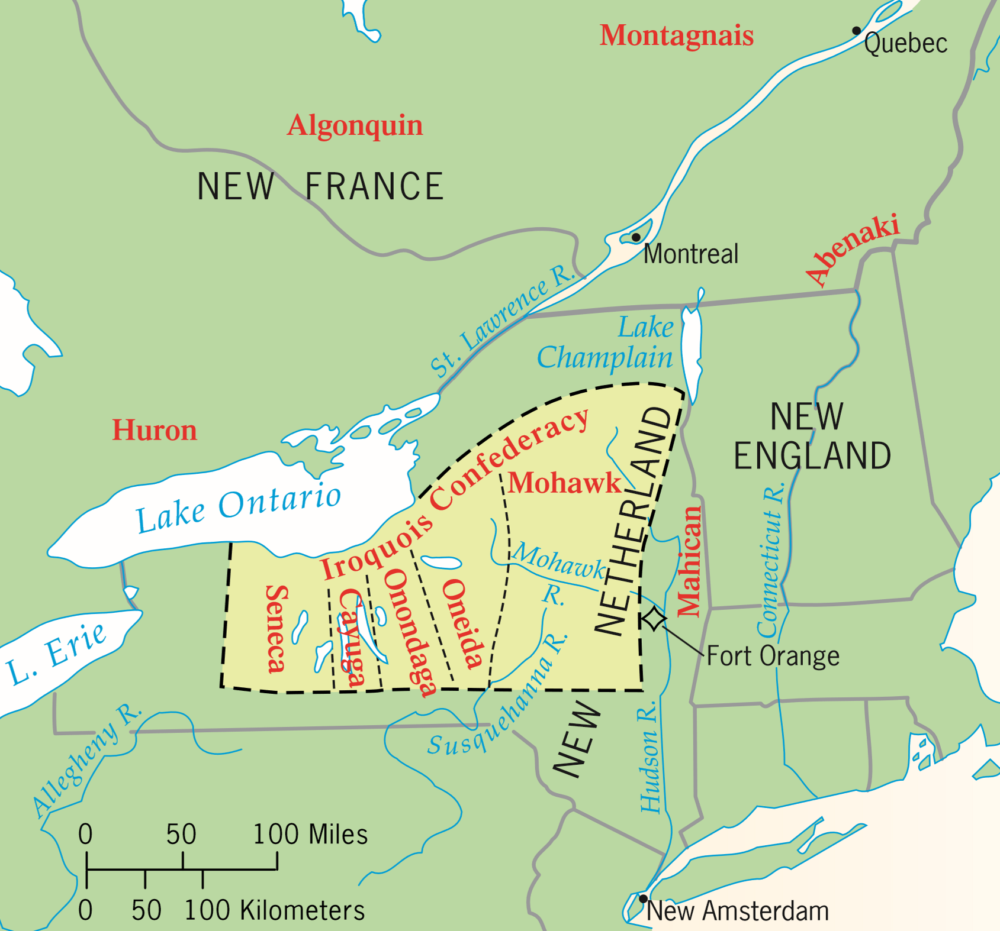
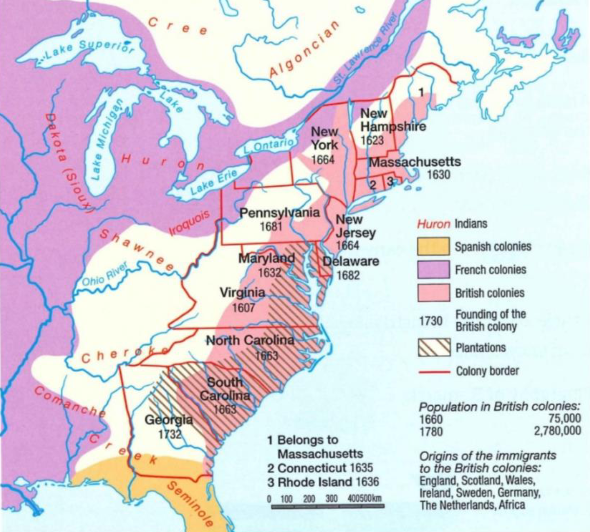
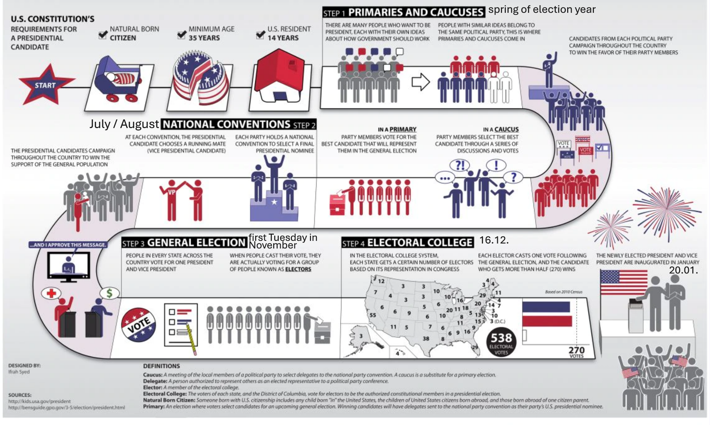

# USA

## Pre-Colonial Population

### Iroquois Confederacy

Many populations lived on the territory we call America today. Some of these populations, though remaining mostly independent, formed an alliance called the **Iroquois Confederacy**[^1]

- territory is today's New York state
- traded with everyone, weren't allied with a particular side
- not mainly hunters, but traders
- longhouses as settlements
- pride in tribe; also fought among themselves
- fought against the **French**, **English** and **Dutch**
- warrior society; fearsome military for natives and Europeans alike
- includes 5 indian nations (see map)
- _Mohawks_[^2] - Middlemen in trade with Europeans
- _Senecas_[^3] - Fur suppliers for trade

### Agriculture - Corn

Although it hadn't arrived in north america yet, **corn** revolutionized the way tribes lived **in south America**

- different times of arrival caused different rates of development in the tribes
- North American equivalent of South American societies didn't exist
- nomadic hunter tribes settled and made agricultural villages
- corn, along with beans and [squash](https://en.wikipedia.org/wiki/Cucurbita "Wikipedia - squash (plant)") made "three sisters" farming possible
- optimal usage of soil and humidity for growing food through **"three sister farming"**:
    1. Corn grows tall, creating a natural trellis[^4] that the beans can climb up.
    2. Beans fix nitrogen in the soil, providing a natural fertilizer that helps the corn grow.
    3. Squash spreads out along the ground, covering the soil with its large leaves, which helps keep moisture in the soil and blocks weeds.
- very high population densities due to efficient farming
- besides agriculture, native societies didn't artificially alter the nature much

## European Colonies

### Colonial Division

After the first successful English colony in **Virginia in 1607**, more colonies started to develop. 
The three colonial groups:

1. **new England colonies**: New Hampshire, Massachusetts, Rhode Island, Connecticut
2. **middle colonies**: New York, New Jersey, Pennsylvania, Delaware
3. **southern colonies**: Maryland, Virginia, North Carolina, South Carolina, Georgia

Not only the English had colonies in America, but also other european nations:

### Population Growth

The population in the American colonies saw a massive increase around the year 1700, for several reasons:

- **high birth rate**: average American family had 7 children
- **low death rate**: better food availability in America led to longer lives than most Europeans
- **immigration**: many Europeans came to America

While the population grew, the _population density_ still wasn't very high, as most people lived on scattered farms.

### Immigration

Common reasons for emigration[^5] to America:

- **economic issues**: bad harvests, declining linen trade _(mostly affecting Scotland & Ireland)_
- **religion**: religious freedom was much more prominent in America

**Work**: Most people emigrated under a **system of temporary servitude**, in which they enter a contract[^6] to offer their labour (usually for 4 years) in exchange for free passage accross the Atlantic.

### Slavery

While the first slaves were already brought to Virginia at the beginning of the 17^th^ century, slavery didn't have it's boom until the 18^th^ century, during which the amount of slaves soared up to 17% of the population.

- **high demand for slaves**: black population grew faster than white population
- **over 95% of slaves were in the south**, with the most in South Carolina
- northern colonies made profit in other ways, mostly through trade:
    - lumber
    - fur
    - shipbuilding
    - iron industry
- still, the mayority of people continued to live from agriculture

### Economy

- 90% of workers were **farmers**
- triangular trade brought great profits:
    - Europe brings African slaves
    - America brings goods produced by slaves to Europe
    - Europe uses money to buy more african Slaves
- England had many **cotton and tobacco imports**
- increase in population and diversification of jobs helped the economy

### Government

- control over slaves through violence (to avoid resistance)
- governor appointed by British king
- everyone was bound to the **English crown**
- _**colonial assemblies**_ were elected by the people (similar to today's parliament)
> While the decisions of the colonial assembly could simply be vetoed by the governor, they still had a lot of power. They were also in charge of the finances.
- up to 80% of **white men** could vote _(which is good compared to England's 15%)_
- women, slaves, black people and native Americans couldn't vote
- qualifications needed for higher offices meant that usually **wealthy lawyers, merchants or landowners** were elected

## Migration Today

- USA has the **most immigrants** in the world (19% of worldwide immigrants)
- most immigrants are **aged 15-34**

countries where people arrive from:

- Europe is not so prominent anymore
- South America and Asia have grown strongly

## Relationship with England

England had significant control over the land, so they could make the rules:

1. **Navigation Act I** (1651): only English ships are allowed to bring products to England and its colonies
2. **Navigation Act II**: certain products (sugar, tobacco, wool, indigo, etc.) are allowed **export only to England**
3. wool, hats and ironmongery[^7] can **only be sourced from England**
4. **Wool Act**: colonies are no longer allowed to export or produce woolen goods or hats
5. **Iron Act**: colonies are no longer allowed to export or produce iron goods
6. **Sugar Act**: increase revenue from colonies → import tax on sugar from [West Indies](https://en.wikipedia.org/wiki/West_Indies "Wikipedia - West Indies")
7. **Stamp Act**: tax on **stamped paper** that should be used in almost every printed paper in the colonies
8. additional taxes imposed on tea, glass, paper etc.
9. stricter surveillance of American ports increased British profits 15-fold

!!! tip "protests"
    The stamp act had to be repealed[^8] due to boycotts. American merchants were no longer buying English products, which damaged the English profits even more. They also protested in New York with the famous slogan _"No taxation without representation"_

## Rebellion and Revolution

The two main powers in America were **Britain and France**. After seven years of war _(1756-1763)_ between them, Britain emerged as the winner. This meant that they got new territory and more power over the land. However, there were also some problems:

- war was expensive → British national **debt nearly doubled**
- Britain set up a **permanent army** of 10'000 soldiers in America
- Britain **raised taxes** and made [new laws](docs/gs/1/summary.md#relationship-with-england "This document - Relationship with England") to pay for debt and army
- many colonists were upset because they **didn't ask for an army**, nor did they accept the fact that England taxed civilians who were **unrepresented at parliament**
- all these concerns led to uprisings and eventually a **revolution**
- people wanted **independence from the British**
- **Declaration of Independence** was written on _4^th^ July 1776_ → the 13 colonies were now free, separated and independent from Great Britain

## Modern Election

Although many years have passed and society has seen great changes, the process of the US presidential election has remained mostly the same:

A few clarifications:

- **Certification**: takes place on January 6^th^; **official confirmation** of who was elected president
- at the primary election, people vote for **delegates** that then will vote for a certain candidate at the **national convention**
    > So the voters don't vote for a candidate directly, but rather for a person that will represent all the voters for that candidate at the national convention
- _either_ a **caucus** _or_ a **primary election** is held, not both[^9]
- the nominee of the national convention is chosen by **their own party** to represent them as presidential candidate
- **"The winner takes it all"**: presidential candidates need more than half of the votes in a state to get **all the votes for that state** _(number of votes depends on population)_
- **swing states**: states where the outcome of the election can't be accurately predicted based on historical facts

    > Swing states are a major point of concern and focus for the candidates, as they can win the votes of an additional state

## Political structure

- Electoral college has **538 electors**; 270 votes are required to be president
- House of representatives has 435 members; Makes laws
- The senate has 100 members, **2 from each state**; Makes laws
- House of representatives and senate **must agree** on a new law for it to be passed
- Supreme Court makes sure that the US Government respects laws; also acts as a "regular" court but for more important cases (e.g. "state vs state")
- Supreme court has 9 members who are assigned **for their entire lives** (or until they resign)
- President and Senate choose Supreme Court members **together**

[^1]: Also called the **League of Iroquois** by the Europeans

[^2]: Also called the **Keepers of the Eastern Fire**

[^3]: Also called the **Keepers of the Western Fire**

[^4]: A structure for climbing plants (more infos [here](<https://en.wikipedia.org/wiki/Trellis_(architecture)> "Wikipedia - Trellis (architecture)"))

[^5]: **emigrating**: _leaving_ a place; **immigrating**: _coming to_ a place

[^6]: also called **indenture**

[^7]: stuff made of metal (like tools or pans)

[^8]: take back, revoke _(in the context of laws)_

[^9]: nowadays caucuses are pretty rare, most parties just hold primaries
