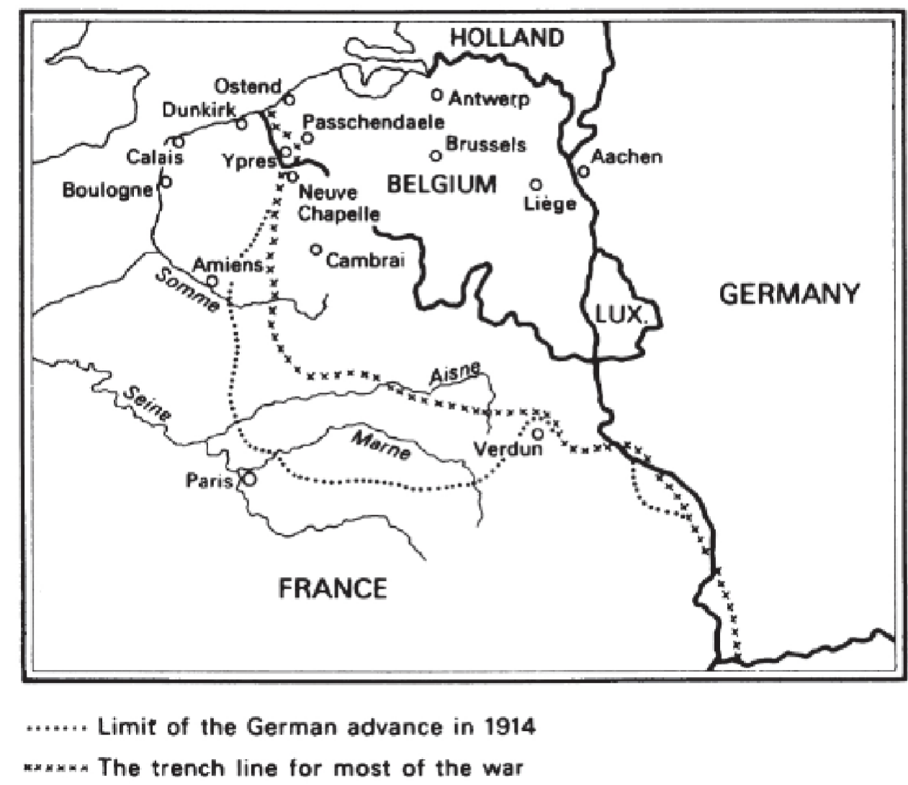
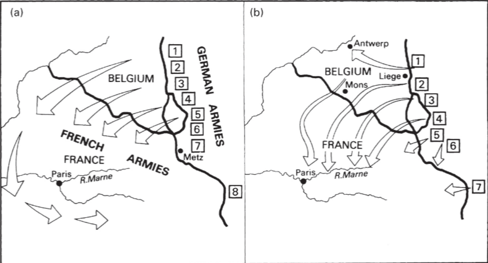
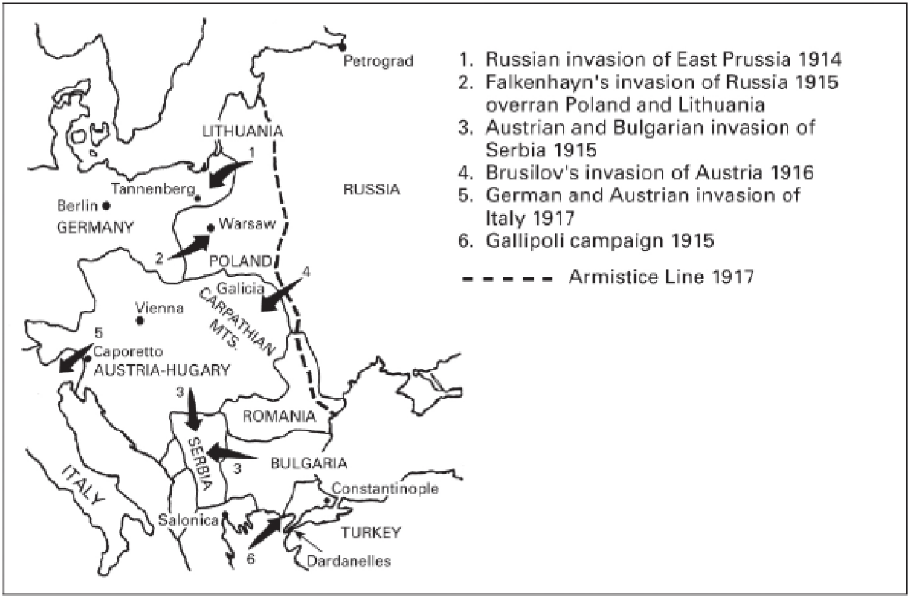

# World War I

!!! note "Video showing geographical developments"
    [This YouTube video](https://www.youtube.com/watch?v=QwsVJb-ckqM) explains and shows the developments during World War I visually on a map. It can serve as a good summary of what happened.

## The Two Sides

**Allies / Entente Powers**:

- Britain & empire
- France
- Russia _(left December 1917)_
- Italy _(entered May 1915)_
- United States _(entered April 1917)_

> **Serbia**, **Belgium**, **Romania** and **Japan** were also included but we didn't really discuss them in class

**Central Powers**:

- Germany
- Austria-Hungary

> **Turkey** and **Bulgaria** were also included but we didn't really discuss them in class

- - -

## The Western Front

??? abstract "Map of the Western Front"
    

### Schlieffen Plan

- Germany's 1914 **Schlieffen Plan**: sweep through Belgium, surround Paris in 6 weeks
- **Belgian resistance** slowed Germany &rarr; gave Britain time to bring troops
- Germans were stopped at the **Battle of the Marne** _(Sep 1914)_
- both sides built **trench lines** &rarr; stretched from the Alps to the Channel
- Germany was forced to fight on **two fronts** simultaneously
- British had time to impose their **naval blockade**

??? abstract "Schlieffen Plan: Expectation vs. Reality"
    a) Germany's expectation of the Schlieffen Plan _(taking Paris in 6 weeks)_

    b) actual outcome of the plan execution _(stopped at Battle of the Marne)_

    

### Challenges of Trench Warfare

- **barbed wire** in no-man's-land made advancing very hard
- clearing the barbed wire using bombs warned the enemy of an incoming attack
- **machine guns** made frontal assaults suicidal and cavalry useless
- ground won formed a _**[salient](https://en.wikipedia.org/wiki/Salient_(military))** (a bulge)_ &rarr; vulnerable to being surrounded
- poison gas (used by Germany at Ypres, 1915) often blew back on attackers

### 1916: Verdun and the Somme

- **Verdun**: German attack to "bleed France dry" &rarr; ~315,000 French & ~280,000 German casualties; _**no territorial gain**_
- **Battle of the Somme**: British offensive to relieve pressure on French at Verdun
    - **20,000** British killed on first day (1 July)
    - still showed Britain was a major military power &rarr; dealt major **damage to German morale**

### 1917: Allied Failure and Tanks

- French **Nivelle offensive** &rarr; mutiny in the French army
- **Third Battle of Ypres** _(Passchendaele)_: ~324,000 British casualties for 4 miles
- **Battle of Cambrai**: 381 British tanks broke through &rarr; proved **tanks could defeat trench deadlock**, but reserves weren't ready to exploit the gap

### 1918: German Spring Offensive and Allied Victory

- **Ludendorff's Spring Offensive** (Mar): broke through on the Somme &rarr; got very close to Paris
- **Allied counter-offensive** (8 Aug, Amiens): hundreds of tanks across a wide front &rarr; Germans forced back continuously
- Hindenburg Line[^1] broken by end of September &rarr; **armistice signed 11 November 1918**

[^1]: A defensive barrier of the Germans on the Western front

- - -

## The Eastern Front

??? abstract "Map of the Eastern Front"
    

### 1914: Russia in Austria & Germany

- Russians mobilised faster than expected; occupied **Galicia** (Austria)
- Germans defeated Russia at **Tannenberg** & **Masurian Lakes** &rarr; Russia lost a lot of equipment &rarr; never fully recovered

### 1915: Black Sea, Germany in Poland

- **Gallipoli Campaign** (GB-FR): attempt to open supply route to Russia via Black Sea &rarr; total failure; all troops withdrawn by December
- Germany captured Russian-held Poland

### 1916: Relieving Verdun Pressure

- **Brusilov Offensive**: Russia attacks Austria to divert troops from Verdun; advances ~100 miles
- Austrians demoralised, but Russians were also exhausted

### 1917: Russia withdraws, Germany in West, USA joins

- **Russia withdraws** (Dec 1917): lack of supplies, incompetent leadership & transport problems
- two Russian revolutions later &rarr; Bolsheviks _(communists)_ are in power; **make peace**
- Germany could now focus **all** forces on the West
- Allies could have lost if not for American support

The United States entered the War in April 1917:

- triggered by **German U-boat campaign** & discovery of the **Zimmermann Telegram** _(Germany promising US territory to Mexico)_
- supplied food, credit, and merchant ships immediately
- by mid-1918: over **500,000 troops** in Europe &rarr; psychological blow to Germany

- - -

## War at Sea

### Allied Naval Strategy

1. **blockade** Central Powers &rarr; starve civilian population
2. keep trade routes open for Britain
3. transport troops across the Channel

### German Response: Submarine Warfare

- Germans failed to destroy British fleet in **Battle of Jutland**
- British set up a naval blockade &rarr; **food shortages in Germany**
- Germans switched to **unrestricted submarine warfare** (Jan 1917)
    - peak: Apr 1917 &mdash; 430 ships sunk in one month; Britain down to 6 weeks of corn
    - **convoy system**[^2] drastically cut allied losses
    - campaign backfired &rarr; **brought the USA into the war**

[^2]: Multiple merchant ships sail together so that the groups can be protected by warships

- - -

## Loss of the Central Powers

- **Schlieffen Plan failed** &rarr; two-front war couldn't be avoided
- **Allied sea power**: blockade caused food shortages and civilian suffering in Germany
- **submarine campaign failed** due to convoys; brought the US in
- USA brought _large amounts of resources_ that the Central Powers couldn't match
- Germany **let down by allies**: Bulgaria, Austria and Turkey collapsed in autumn 1918

- - -

## Effects of the War

> The _"short war illusion"_ is increasingly questioned as archival research shows German military planners knew in advance that the war could last 6 months to 2 years

- ~**2 million Germans**, 1.7 million Russians, 1.5 million French, ~1 million British _(including empire)_ dead
- **4 empires collapsed**: German, Austro-Hungarian, Russian, Ottoman
    - _Germany_: Kaiser Wilhelm II abdicated &rarr; Weimar Republic
    - _Austria-Hungary_: split into separate states
    - _Russia_: Bolshevik revolution &rarr; USSR
    - _Ottoman Empire_: dissolved
- **women** took factory jobs &rarr; long-term shift in gender roles
- **USA** rose as global economic power; Europe's prestige declined
- controversial peace settlement at **Versailles** (1919) planted seeds for future instability

- - -

## Factsheet

> The most important events _(in my opinion, so take it with a grain of salt)_ and the **bare minimum** you need to know about them.

| Event / Fact | Details |
|---|---|
| **Allies vs. Central Powers** | &bull; Allies: Britain, France, Russia, USA  &bull; Central Powers: Germany, Austria-Hungary |
| **Outbreak of the war** | &bull; 1914 &bull; triggered by assassination of Archduke Franz Ferdinand &bull; alliances pulled everyone in |
| **Battle of the Marne** | &bull; September 1914 &bull; ended short-war hopes &bull; stalemate on Western Front began |
| **Verdun & the Somme** | &bull; 1916 &bull; no real progress on any side &bull; combined ~1 million casualties &bull; Somme broke German morale |
| **US entry / unrestricted submarines** | &bull; April 1917 &bull; German submarine campaign backfired &bull; USA joined the Allies |
| **Russia withdraws** | &bull; December 1917 &bull; Bolshevik revolution &bull; Germany could focus on west |
| **Armistice** | &bull; **11 November 1918** &bull; signed after Allied breakthrough & German collapse |

- - -

## Swiss Military Situation

- **neutrality obligation**: Switzerland had to defend its territory against _all_ warring parties
- **Aktivdienst** _(active duty)_: army secured the borders throughout the war
    - Aug 1914: 238,000 men + 45,000 horses mobilised
    - afterwards: 40,000–60,000 soldiers on average at any time
    - soldiers served up to 600 days total
- daily pay: only **80 Rappen** &rarr; no income replacement for families
- army lacked **combat experience**, ammunition, and artillery
- steel helmets only issued in **1918**; air force built from scratch in 1914

### General Ulrich Wille

- elected by parliament on **3 August 1914**
- known to be **pro-German**; had close ties to Germany through his wife _(Clara von Bismarck)_
- his "System Wille" prioritised discipline and drill over equipment
- ~10% of soldiers received disciplinary punishments; 1,500+ cases of insubordination, 40 mutinies

---

### Internal Tension

- **Röstigraben**: cultural-linguistic split within Switzerland
    - _German-speaking_ Swiss &rarr; sympathised with Germany & Austria-Hungary
    - _French- and Italian-speaking_ Swiss &rarr; sympathised with the Entente
- warring powers **bought shares in Swiss newspapers** to influence public opinion
- Swiss papers had few foreign correspondents[^3] &rarr; relied on foreign war reporting

[^3]: Journalists contributing reports from a foreign location _(i.e. outside Switzerland)_

### Key Scandals

- **Obersten-Affäre (1915/16)**: two German-Swiss colonels passed Swiss army documents to the Prussian general staff &rarr; military neutrality violated
    - General Wille dismissed it as mere "tactlessness"; colonels acquitted[^4] at trial, only mildly disciplined
    - caused outrage in western Switzerland; deepened distrust in military leadership

[^4]: Declared not guilty

- **Hoffmann-Grimm-Affäre (1917)**: Bundesrat Arthur Hoffmann secretly mediated a separate Russo-German peace
    - telegram intercepted by the Entente &rarr; seen as neutrality breach
    - Hoffmann forced to **resign**; replaced by pro-French Gustave Ador

---

### Economic Situation

#### Trade & Supply

- Switzerland was **completely surrounded** by warring states &rarr; all imports and exports controlled by them
- warring powers only supplied goods if they wouldn't reach the enemy
- **Société Suisse de Surveillance Économique (SSS)** set up by the Entente (end of 1915); Central Powers set up a _Treuhandgesellschaft_ in Zürich already in 1915
    - all Swiss trade routed through these bodies &rarr; Switzerland gave up significant **economic sovereignty**
    - private cross-border trade effectively abolished; fully state-controlled

#### Industry & Workers

- exports of war-relevant goods _(watches, metals, machines, copper products)_ rose sharply &rarr; **war boom** for certain sectors
- **Fabrikgesetz** relaxed by Bundesrat in 1914 &rarr; working hours extended beyond 11 h/day
- women entered the workforce in large numbers as men were on duty
- not _all_ sectors benefited: hotels and tourism suffered badly from absence of foreign guests

#### Social Consequences

- food rationing only introduced in **1917** &rarr; prices had already risen sharply before
- by summer 1918: **700,000 of ~4 million** Swiss residents dependent on aid
- those who _had_ scarce goods profited &rarr; publicly denounced as **Kriegswucherer** _(war profiteers)_
- Bundesrat introduced a **Kriegsgewinnsteuer** _(war profits tax)_ in autumn 1916; raised ~730 million CHF
- social divide grew visibly throughout the war

---

### Treatment of Foreigners

- pre-war: free movement of persons; foreign population reached ~**15%** before 1914
- during war: Bundesrat severely restricted cross-border movement
- autumn 1915: stricter border controls to keep out "undesirable" foreigners
- from summer 1916: increasing numbers of **military refugees** arrived &rarr; nearly **26,000** by war's end
- November 1917: Bundesrat founded the **"Zentralstelle für die Fremdenpolizei"** for border and entry controls
- growing official distinction between "welcome" and "unwelcome" people

---

### Factsheet

| Fact | Details |
|---|---|
| **Ulrich Wille** | &bull; General &bull; pro-German &bull; elected 3 Aug 1914 |
| **Mobilisation** | &bull; Aug 1914 &bull; 238,000 men &bull; avg. 40,000–60,000 on active duty |
| **Obersten-Affäre** | &bull; 1915/16 &bull; two German-Swiss colonels leaked documents to Prussia &rarr; acquitted |
| **Hoffmann-Grimm-Affäre** | &bull; 1917 &bull; Bundesrat Hoffmann mediated secret Russo-German peace &rarr; forced to resign |
| **SSS / Treuhandstelle** | &bull; from 1915 &bull; all Swiss trade controlled by warring powers' bodies |
| **Social crisis** | &bull; by 1918 &bull; 700,000 / 4M Swiss dependent on aid &bull; food rationing from 1917 |
