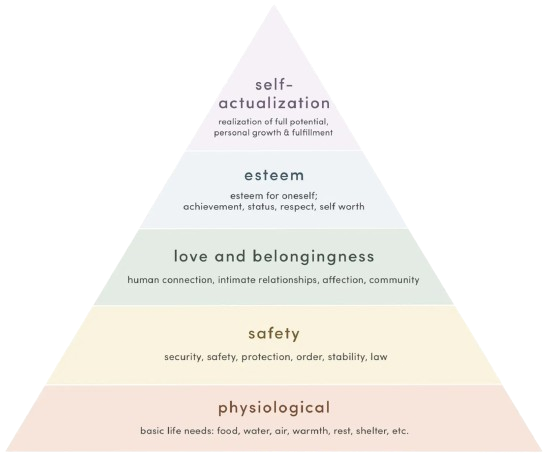
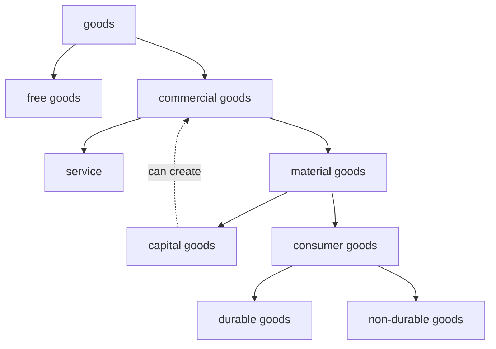
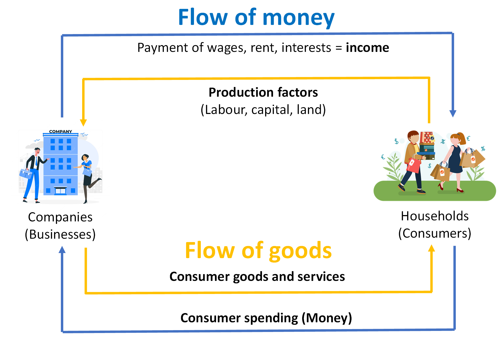
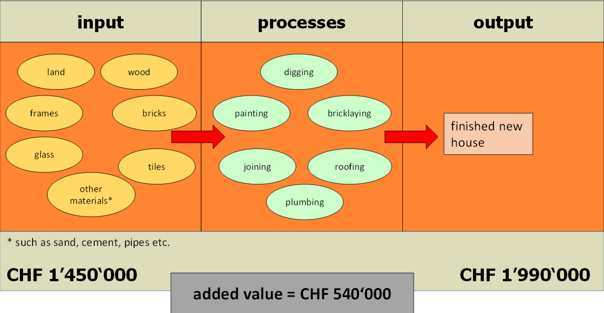
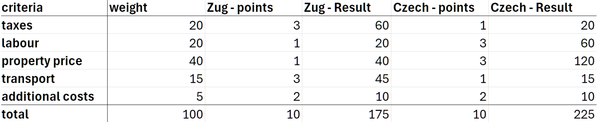

# Introduction

## Subjects

<!--prettier-ignore-->
- **Business administration**: Management of companies

    - purchasing, logistics, production, marketing
    - focused on one company specifically

- **Economics**: Analysis of general state of factors in the economy

    - interest rates, unemployment, inflation, economic growth
    - focused on broader categories, societies or even the whole world

- **Law**: Binding customs, practices and rules of a community / society

    - differentiating between _moral_, _custom_ and _law_
    - enforcment of laws through a controlling authority

---

## The Economic Problem

<!--prettier-ignore-->
!!! summary ""
    The economic problem refers to the fundamental issue of _scarcity_ in relation to unlimited human wants and needs

- Humans have unlimited wants → always need more / new / better products
- Resources are limited → there are not enough means to satisfy _all_ needs
- These factors result in scarcity

---

## Needs

All human needs can be categorized into three different groups, according to the **urgency of the satisfaction[^1]**:

<!--prettier-ignore-->
- **subsistence needs**: What is needed in order to stay alive; most basic necessities
    - food
    - water
    - shelter
- **basic needs**: Beyond survival, things that are beneficial to our lives in general; influenced by societal norms
    - household items (e.g. dishwasher, bed, books)
    - leisure activities (e.g. cinema, parks, roads)
- **luxury needs**: Luxuries that people with higher income can afford; beyond basic needs
    - expensive jewelry
    - second home

<!--prettier-ignore-->
!!! note
    The distinction between basic and luxury needs is neither fixed nor permanent. While a dishwasher may have been considered a luxury at one point, it has now become a part of most apartments.

Furthermore, needs can also be categorized by the **number of people that need affects**:

<!--prettier-ignore-->
- **collective needs**: Needs that many people are affected by and where many peole are neede to satisfy the need; often by the state
    - national defense system
    - highways
- **individual needs**: Needs that a person fulfills on their own, which don't really affect other people
    - phone
    - bike

<!--prettier-ignore-->
!!! note
    The categorization by _number of people_ and by _urgency of fulfillment_ don't exclude each other; e.g. a phone is a basic individual need, while a supply of drinking water can be a collective subsistence need.

### Abraham Maslow's Pyramid of Needs

- Shows the different human needs
- Some needs are more basic (at the bottom of the pyramid)
- Higher needs can only be fulfilled if the lower needs are already satisfied

---

## Types of Goods

<!--prettier-ignore-->
- **free** goods: (theoretically) unlimited supply, free
    - freedom, air, health
- **commercial** goods[^2]: Limited supply, price is charged
    - book, banana, bus ticket
- **services**[^3]: No physical object, but a provided service
    - spotify subscription, bus ticket, museum entrance fee
- **material** goods[^4]: Physical object
    - book, banana, camera
- **capital** goods: Goods that can create other goods
    - machines in car production, camera (e.g. for YouTube videos), oven (if you sell bread)
- **consumer** goods: Goods that are only for use and don't create other goods
    - book, banana, yoyo
- **durable** goods: Goods that can be used multiple times
    - book, yoyo, glass water bottle
- **non-durable** goods: Goods that are consumed; are useless once you've consumed them
    - cake, banana, firecracker

Here is a diagram categorizing the different types of goods:

---

## Economic Principles

<!--prettier-ignore-->
!!! note ""
    An economic principle tries to achieve a reasonable ratio between the input and output value of an activity

- **maximum** principle: Achieve maximum output with a fixed input
- **minimum** principle: Achieve fixed output at a fixed input
- **optimum** principle: Achieve a balance when neiter input nor output is specified

---

## Homo Economicus

<!--prettier-ignore-->
???+ warning
    In some of the materials, it is incorrectly written as "homo _**oe**conomicus_". The correct way would be "homo **e**conomicus", as seen [^^here^^](https://en.wikipedia.org/wiki/Homo_economicus "Wikipedia article for homo economicus")

### Description

- concept for describing a perfectly rational human
- maximizing profit as main goal
- reach high profits through efficient decisions
- complete self-interest, not influenced whatsoever by other people or their interests
- has perfect access to information

### Critics

- not representative of real-life human
- egoistic nature of homo economicus goes against the moral of many peole
- humans are influenced by many factors (emotions, competition etc.)

---

## Factors of Production

The factors of production refer to the resources, labour, etc. that go into producing a certain product.

- **Land**: Required natural resources (minerals, water, actual land on which e.g. the factory stands)
- **Labour**: Effort, skills and time of the workers producing the good
- **Capital**: Physical assets used in the production of the goods / services (tools, machines etc.)

---

## Circular Flow

<!--prettier-ignore-->
- concept describing the flow of money and goods
- two cycles: money and goods
- **money** flows in two directions:
    - **company → household**: personal income (wages, rent, interests) 
    - **household → company**: consumer spending (paying for commercial goods)
- **goods** flow in two directions:
    - **company → household**: commercial goods
    - **household → company**: production factors (labour, capital, land)

---

## Gross Domestic Product (GDP)

- gives a rough estimate of **market value added** by a country over a specific period of time
- only measures effective value added, not total value
- isn't proportional to population → large countries tend to have larger GDP
- GDP per capita divides GDP by population → measures average economic output per person

### Shortcomings

- Doesn't give a good estimate of quality of life
- Doesn't measure health, state of education, state of environment etc.
- Doesn't measure stability of economy (wether it's headed for a crash or is healthy)
- Money isn't everything for the hapiness of the citizens

<!--prettier-ignore-->
!!! info "Alternatives"
    There are alternative ways of measuring other aspects of a society, such as the **World Hapiness Report**, in which citizens answer surveys about how happy they perceive themselves to be

### Example

---

## Company Criteria

You can categorize companies using the following criteria:

- economic sector
- size (number of employees)
- ownership structure
- profit orientation
- legal form

### Economic Sector

There are three economic sectors:

<!--prettier-ignore-->
- **primary** sector: Sourcing raw materials directly from nature
    - agriculture, hunting, forestry
- **secondary** sector: Producing goods using the materials supplied by the primary sector
    - automobile industry, shipbuilding, textile industry
- **tertiary** sector: Offering services or products based on the goods supplied by the secondary sector
    - retailers, banks, tourism

### Size

- **< 250** employees: _SME_ → Small and Medium Enterprises
- **> 250** employees: large enterprises
- 99% of companies registered in Switzerland are SMEs

### Ownership Structure

A company can be owned by multiple people from different parts fo society:

- **private** ownership: not listed on a stock exchange, only private people own it
- **mixed** ownership: can be listen on a stock exchange, ownership divided between private people and state
- **public** ownership: listed on a stock exchange, people buy shares and thereby divide the ownership

### Profit Orientation

- **non-profit**[^5]: company doesn't make net profits from sold goods, but tries not to make losses
- **profit-oriented**: company aims to make profits

### Legal Form

<!--prettier-ignore-->
- **Sole Proprietorship**:
    - activity is closely linked to the owner
    - owner is fully liable for all debts
    - name always contains the surname of the owner
- **General Partnership**:
    - small companies where the activity is closely linked to the partners
    - partners have shared liability for all debts
    - name always contains "KLG"
- **Limited Liability Company**:
    - privately owned SMEs
    - no personal liability
    - name always contains "GmbH"
- **Limited Company**:
    - big, profit-oriented companies
    - no personal liability
    - name always contains "AG"

---

## Cost-Benefit Analysis

Usage: Come to a conclusion regarding a decision involving different factors of different importance

1. List the options
2. List the criteria that should be taken into consideration for each option
3. Determine how important each criteria is (in %) → $W$
4. Allocate a rating (e.g. 1-3) per individual criteria of each option → $P$
5. Calculate the total weighted points for each individual criteria → $\sum_{i = 0}^{n} W_i \cdot P_i$ (for $n$ criteria)
6. Compare results → highest points wins

[^1]: How urgent it is that the need is fulfilled

[^2]: Also called **economic goods**

[^3]: Also called **intangible goods**

[^4]: Also called **tangible goods**

[^5]: Non-profit companies are also called _non-profit organizations_, NPO for short
