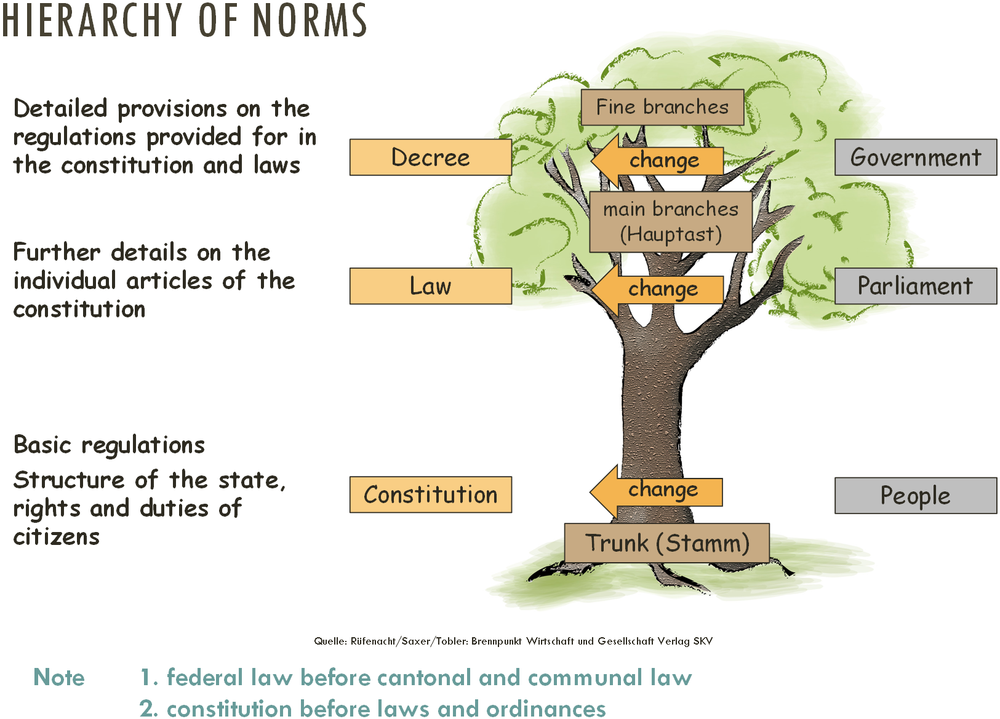
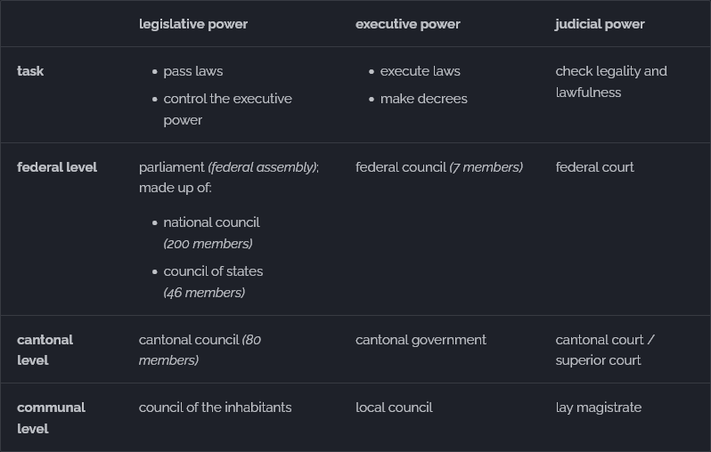

# Law

## Morals, Customs and Law

| morals                                   | customs                                                | law                                                         |
| ---------------------------------------- | ------------------------------------------------------ | ----------------------------------------------------------- |
| **internal** behaviour, _not enforcable_ | behaviour towards **external** world, _not enforcable_ | behaviour towards **external** world, _enforced by the law_ |
| attitude                                 | manners                                                | traffic laws                                                |
| values                                   | politeness                                             | prohibition of theft                                        |

## Functions of the Law

[Art. 2 Cst.](https://www.fedlex.admin.ch/eli/cc/1999/404/en#art_2 "Swiss federal constitution - Art. 2") explains the aims of the constitution:

> ^1^ The Swiss Confederation shall **protect the liberty** and rights of the people and safeguard the independence and security of the country.
>
> ^2^ It shall promote the **common welfare**, sustainable development, internal cohesion and cultural diversity of the country.
>
> ^3^ It shall ensure the greatest possible **equality** of opportunity among its citizens.
>
> ^4^ It is committed to the long term preservation of natural resources and to a just and peaceful **international order**.

## Principles of the Rule of Law

- state can use Art. 2 Cst. to justify almost any action
- states **power needs to be limited** in order to avoid a [totalitarian state](#totalitarian-state)

introduction of the **principles of rule of law**:

- **principle of legality**: [Art. 1 para. 1 CC](https://www.fedlex.admin.ch/eli/cc/24/233_245_233/en#art_1 "Swiss civil code - Art. 1") states that you can only be convicted of a crime if that crime is explicitly forbidden
- **separation of powers**: responsibilities are split into **three branches** to avoid absolute / abuse of power (*[separation of powers](#separation-of-powers)*)
- **guarantee of fundamental rights**[^1]: specified in the [constitution](https://www.fedlex.admin.ch/eli/cc/1999/404/en "Swiss federal constitution"):
   Art. 7: human dignity
   Art. 8: equality before the law
   Art. 10: right to life and personal freedom
   Art. 13: right to privacy
   Art. 15: freedom of religion and conscience
   Art. 16: freedom of expression and information
   Art. 19: right to basic education
   Art. 22: freedom of assembly
   Art. 26: guarantee of ownership[^2]
> funamental rights can also be restricted, as stated in [Art. 36 Cst.](https://www.fedlex.admin.ch/eli/cc/1999/404/en#art_36 "Swiss federal constitution - Art. 36")

[^1]: The term "_fundamental_ rights" is used in a **constitutional** context, while the term "_human_ rights" is used in **international law**
[^2]: You are allowed to buy stuff. When you do, the property you bought is yours

## Hierarchy of Norms

Legal provisions are divided into **three levels**:

1. **constitution**: most important and basic rules, required for a functioning state
    - guarantees **basic rights** of the people
    - distributes tasks between confederation and cantons
    - **basis for all other laws**
    - to change the constitution &rightarrow; 100'000 signatures in 18 months &rightarrow; votes required from **canton _and_ population**[^3]
2. **law**: detailed implementation of individual articles of constitution
    - parliament can change a law "without asking"
    - once a law is approved, citizens can **request a referendum**[^4]
    - for referendum to be held &rightarrow; 50'000 signatures in 100 days
3. **decree**: set of rules made to help put a specific law into action
    - is **based on a specific law** and cannot exist on its own
    - made by the government *(executive power)*, not the parliament *(legislative power)* &rightarrow; faster implementation process

??? abstract "textbook representation of the hierarchy of norms"
    

[^3]: This is called the _double majority_. It is done so that the densely populates areas don't have too much control over the sparsely populated regions.
[^4]: A vote on the new law, potentially also proposing changes or voting "no"

## Totalitarian State

| rule of law _(e.g. Switzerland)_                                                                                        | totalitarian state _(e.g. North Korea)_                                              |
| ----------------------------------------------------------------------------------------------------------------------- | ------------------------------------------------------------------------------------ |
| principle of legality                                                                                                   | authorities are **barely bound to the law** and have free judgement                  |
| separation of powers                                                                                                    | **power is concentrated** in the hands of highest authorities or even one individual |
| fundamental rights guaranteed by the constitution and law, additionally protected by non-government courts if necessary | barely any fundamental rights                                                        |

## Separation of Powers

- **prevent abuse** of power or absolute power
- system of **checks and balances** to assure the cooperation and functioning of the system
- split into **three branches**:

")

## Public and Private Law

- **public law**: matters concerning the **government, laws or public interest**  examples:
    - constitutional law *(regarding the constitution)*
    - administrative law *(regarding the application of the laws)*
  
- **private law**: disputes between two individuals, companies etc. but **not concerning the government** or the public  examples:
    - family law *(marriage, divorce, inheritance)*
    - property law *(ownership of land or goods)*

## Legal Principles of Private Law

- court has the following approach when checking laws *(Art. 1 para. 1 CC)*:
    1. **written law**: constitution, laws and decrees
    2. **customary law**: non-written law (originally a custom that has been now accepted as law)
    3. **court law**: decisions made previously by higher courts that lower courts must respect; if no law is present, the judge makes one himself
- **good faith**: act honestly and fairly, don't take advantage of others *(Art. 2 para. 1 CC)*
- **prohibition of abuse of rights**: don't exercise your rights in such a way that you're obviously abusing them[^5] *(Art. 2 para. 2 CC)*
- **presumption of good faith**: people are always assumed to have acted in good faith until evidence proves otherwise *(Art. 3 para. 1 CC)*
- **bad faith**: if it's clear that you knowingly participated in an action in bad faith, you're assumed to have acted in bad faith as well *(Art. 3 para. 2 CC)*
- **burden of proof**: if you gain rights from accusing somebody of something, you must prove your accusation using legally relevant evidence *(Art. 8 CC)*

[^5]: Example: playing very loud music to annoy your neighbours. Even though you're legally allowed to, it's still illegal because you're abusing your rights
