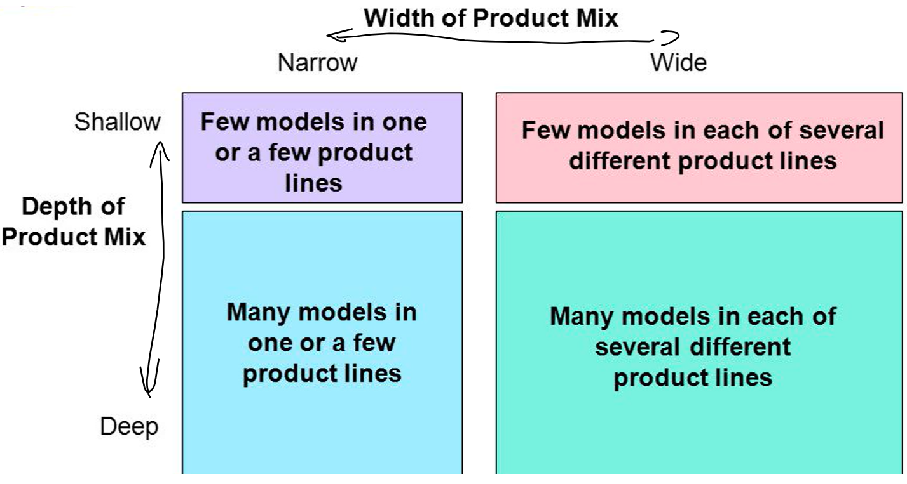

# Marketing

## Market Analysis

### Market Size

- used to find information about sales opportunities
- market **capacity**: Price of maximum number of products that could _theoretically_ be sold
- market **potential**: Price of maximum number of products that people could actually _afford_ to buy
- market **volume**: _Actual_ price of sales currently being made in the market
- market **share**: _Portion_ of the total market volume that belongs to a specific company[^1]
- **relative market share**: Market share compared to _largest competitor_ &rightarrow; $\frac{\text{own market share}}{\text{market share of largest competitor}}$ 

[^1]: Measures competitive strength of the company compared to its competitors

??? tip "Example: Smartphone market"
    Imagine **10 million people** in a country, **70%** of which can **afford** a smartphone. Currently, **5 million** smartphones are being sold in that country, of which your company is selling **2 million**.

    | metric | value |
    |:-|:-|
    | market **capacity** | 10 million smartphones |
    | market **potential** | 7 million smartphones |
    | market **volume** | 5 million smartphones |
    | market **share** of your company | 40% |

### Market Growth and Saturation

**saturated** market

- market _volume_ is close to market _potential_
- new customers can't be attracted
- focus on "stealing" customers _(and thus market share)_ from competitors

**growing** market

- market _volume_ is far from market _potential_
- new customers can be acquired
- address unmet needs, explore new segments, innovate

### Market Segmentation

criteria for market segmentation:

- **geographic**: territory, population, climate, language, ...
- **socio-demographic**: age, gender, income, occupation, education, ...
- **values & behaviour**: values, lifestyle, hobbies, priorities, ...

"_segment of one_":

- very precise segmentation
- each customer has **their own** advertising profile
- increasingly used online

- - -
## Performance Analysis

Used for analysing the performance of a product[^2]

### Portfolio Analysis

> The portfolio analysis is also called the **BCG Matrix**

Products can be categorized into **4 categories**:

- **star**:
    - _high_ market share in a _growing_ market
    - protect market share from competitors, invest money
- **cash cow**:
    - _high_ market share in a _saturated_ market
    - use profits from this establish product to finance other products
- **question marks**:
    - _low_ market share in a _growing_ market
    - either invest a lot to make the product successful or just take it off the market
- **poor dog**:
    - _low_ market share in a _saturated_ market
    - end investments, take teh product off the market to free resources

[^2]: This is done periodically after a product is launched

### Product Life Cycle

Life cycle of a product can be categorized into **5 phases**:

1. **introduction** &rightarrow; question mark
    - profit _rate_ and sales rise
    - negative profit due to initial investments into the product
2. **growth** &rightarrow; star
    - profit and sales rise sharply
    - profit rate starts to flatten as initial hype subsides
3. **maturity** &rightarrow; cash cow
    - profit rate begins sharp decline
    - profit starts slow decline
    - sales slow their growth
4. **saturation** &rightarrow; (still) cash cow
    - profit rate reaches 0
    - profit continues to decline
    - sales start going down
5. **decline** &rightarrow; poor dog
    - profit goes to 0
    - sales continue to decrease

- - -
## Market Research

There are two main types of market research:

- **quantitative**: researching actual numbers
    - size of the market volume
    - market share
    - average costs of production for a product category
- **qualitative**: researching consumer buying behaviour
    - expectations of customers for a specific product
    - reasons for buying a specific product
    - age groups most interested in a product category

This data is collected through two **survey methods**:

- **primary** market research _(aka field research)_: collection of new, previously nonexistent data
    - interviews, observations
    - experiments
- **secondary** market research _(aka desk research)_: evaluation of existing data that was originally collected for other purposes
    - internal sources, statistics, customer complaints
    - annual reports of other companies, poll results for adjacent topics

- - -
## Cookies

- **small files** stored in your browser
- allow websites to **recognize** you accross your browsing activity
- used in building a personalized advertising profile that can be **sold** &rightarrow; source of profit
- allows for more **accurate targeting** of advertisements
- privacy concerns &rightarrow; very accurate and private information

> If you want to know more about HTTP cookies, you can find more information by a reputable source (Cloudflare) [here](https://www.cloudflare.com/en-gb/learning/privacy/what-are-cookies/), as this an important topic also outside of this exam.

- - -
## Goals

> _"In life you need goals. In marketing, you also need goals."_
> - L.M., 12.09.2025

**Market goals** establish _how_ you're selling your product:

- customers needs
- market segmentation
- market share

**Product goals** establish _what_ it is exactly that you're offering:

- product design
- product range selection _(see below)_
- production volume

The **product range selection** determines what kind of selection you will offer:

- based on _depth_ and _width_
- focus on different _types_ of products or different _versions_ of the same type?

??? abstract "diagram of the product range selection"
    
