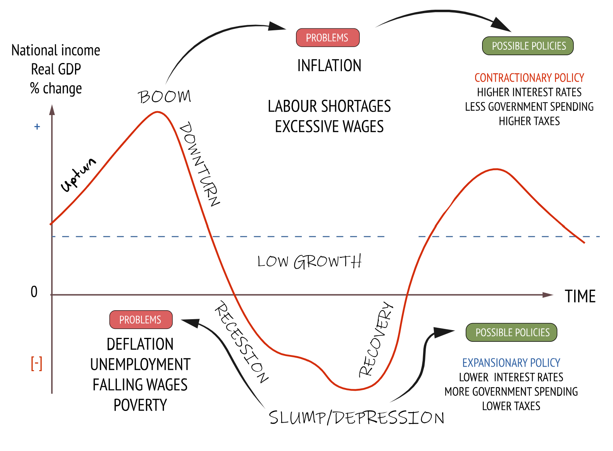
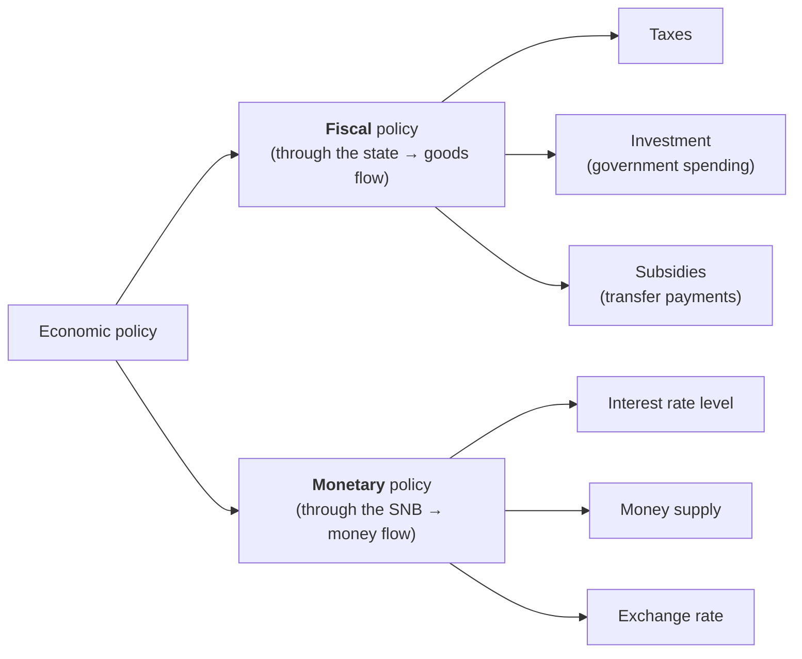

# Economics II

- - -
## GDP

- **nominal** GDP:
    - value of all goods and services in a coutry
    - doesn't account for inflation &rightarrow; uses today's currency
    - value is higher than that of real GDP
- **real** GDP:
    - value of all goods and services in a country
    - adjusted for inflation &rightarrow; comparison to base year
    - value is lower than that of nominal GDP

- - -
## Economic Growth

> _An increase in the amount of goods and services produced per head of the population over a period of time._

Economic growth leads to:

- higher purchasing power
- higher production & availability of goods
- government has more money to maintain / expand inrfastructure

### Sources of Growth

**Labour**:

- **labour force potential**: all pepople within a society that are actually willing to work
- **productivity of labour**: quantity of produced services / goods for 1h of work

**Real Capital**:

- **amount** of real capital: non-financial assets like machines, employees or forests
- **productivity** of real capital: _efficiency_ of the means of production[^1]

**Knowledge**:

- **human capital**: experience and skills of the workers
- **technological progress**

[^1]: This could be e.g. how many bottles per hour a factory machine produces

**Natural Resources**:

- **amount of resources**
- **productivity of resources**: how well the resources are put to use

- - -
## Sustainable Growth

> Sustainability is the act of fulfilling the current needs without compromising the ability of future generations to do so

- _social_: **Gini coefficient** measures inequalities in income / wealth distribution
- _environment_: **Emissions Trading System** allows companies to trade the right to emitting greenhouse gases
- _economic_: **public debt** indicates how well a state manages public money

!!! tip "Justification of Public Debt"
    - loans should finance projects with projected long-term revenue (e.g. infrastructure)
    - if loans are used for e.g. defense (no long-term returns) &rightarrow; interest may not be covered
    
    - - -
    rules for borrowing money:

    1. spend loans on things that **create value** so you can pay back the debt with interest
    2. the debt should **never grow faster than the economy**, else paying it back will be hard
    3. spending should increase at the same rate as the economy

- - -
## Swiss Debt Brake

Switzerland has safeguards in place to stabilise the debt level and avoid a rapid increase in public debt as it happened the last time in the 1990s:

- government spending is not allowed to overshoot income over time
- during economic booms &rightarrow; use surplus revenues to pay off debt
- during recessions &rightarrow; taking on debt is permitted
- result: **economic balance** accross economic cycles
- debt brake allows debt during crises _(e.g. pandemics or wars)_, but it should be paid off as soon as possible

- - -
## Business cycles

- irregular but **periodic** up-and-down movement in economic activity
- economic growth can be strongly influenced by crises, wars, pandemics etc.

Different phases in the economic cycle:

- **Boom**:
    - economy is strong
    - people are **spending more** due to **increased wages** and **more jobs**
    - investments and entrepreneurship thrive &rightarrow; many new businesses
    - risk of **rising inflation** due to strong demand
- **Downturn** (Contraction):
    - economy is declining
    - people are **spending less** due to **layoffs**
    - companies cut costs and investments
    - can precede a _recession_
- **Recession**:
    - **rising unemployment** causes **lower demand**
    - potential for **falling inflation rate**
    - production & import slows with declining customer demand
    - can precede a _depression_
- **Upturn**:
    - economy resumes its growth
    - **lower unemployment** due to businesses hiring again
    - **rising demand and consumer spending** as financial stability is regained
    - **growing investments** as companies prepare for future growth again

??? abstract "Textbook representation of the business cycle"
    

- - -
## Economic Indicators

**Leading** indicators:

- **anticipate** trends &rightarrow; change _before_ the broader economy shifts
- means of forecasting economic activity
- examples:
    - incoming orders
    - consumer mood
    - building permits
    - job vacancies[^2]

[^2]: This means that companies are looking to hire people and therefore expand as they anticipate good times for business

**Coincident** indicators:

- **move with** trends &rightarrow; change _simultaneously_ with the broader economy
- reflect the present economy
- examples:
    - investment
    - consumption
    - turnover _(revenue)_
    - exports

**Lagging** indicators:

- **react to** trends &rightarrow; change _after_ economy shifts
- can confirm economic developments / patterns
- examples:
    - prices
    - unemployment
    - salaries
    - interest rates

- - -
## Economic Policy

- aims to achieve **balanced GDP growth** in a stable economy
- employs **countercyclical measures** to counteract market swings

### Fiscal policy

> **Government** adjusts spending levels and tax rates to influence overall economic activity

Situations where fiscal policy is usually needed:

- **recessionary** gap:
    - real GDP < potential GDP[^3] at full employment
    - **low** capacity utilisation

- **inflationary** gap:
    - real GDP > potential GDP at full employment
    - **high** capacity utilisation

Fiscal policy can be implemented in two ways:

- **contractionary** fiscal policy:
    - reducing government spending
    - raising taxes
    - pulls the economy down if it advances too strongly
- **expansionary** fiscal policy:
    - increasing government spending
    - lowering taxes
    - pulls the economy up during a downturn / recession / depression

[^3]: The maximum level of _real_ GDP an economy can sustain long-term without causing inflation

### Monetary Policy

> **National Bank** adjusts money supply, interest rates and conversion rates to achieve a well-balanced economic development

| Instrument \\ phase    | Recession                                                                 | Boom         |
|------------------------|---------------------------------------------------------------------------|--------------|
| Interest rate shall... | Be lowered                                                                | Be raised    |
| Money supply shall...  | Be raised                                                                 | Be lowered   |
| Conversion rates shall... | Be raised _(more CHF per EUR)_ = weaker currency / devaluation of the Swiss Franc = more exports | Be lowered   |

- main instrument &rightarrow; **interest rate** for other banks to borrow money
- SNB aims for an inflation of **0-2% yearly**
- adjustments are very slow &rightarrow; up to **2 years** until effects are visible
- monetary policy is siginicant in the **short to medium term**
- policy rate increases can have far-ranging consequences:
    - declining demand for goods and services
    - domestic currency appreciation
    - decreasing exports
    - increasing imports
    - rising market interest rate

!!! warning "Policy rate vs market rate"
    The **policy rate** is the interest rate set by the **Swiss National Bank** (SNB) to regulate how much it costs _other banks_ to borrow money from them. The **market interest rate** is the rate at which businesses and people can borrow money from the "regular" banks. Policy rate influences market rate, but they aren't always equal.
